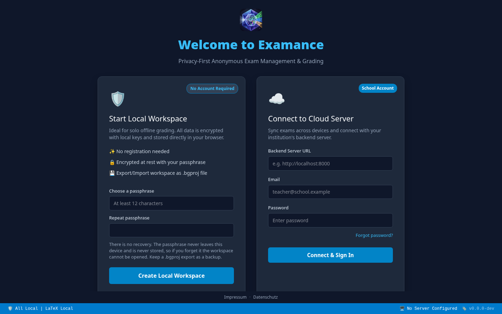
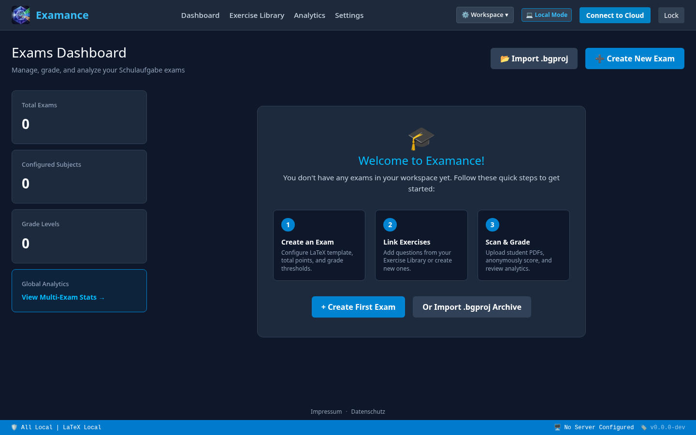
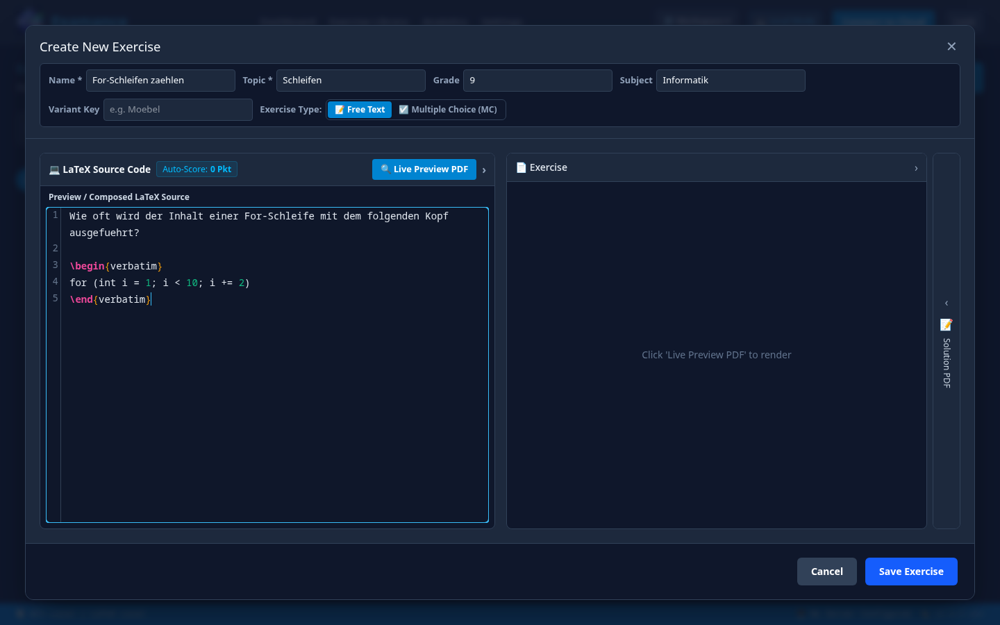
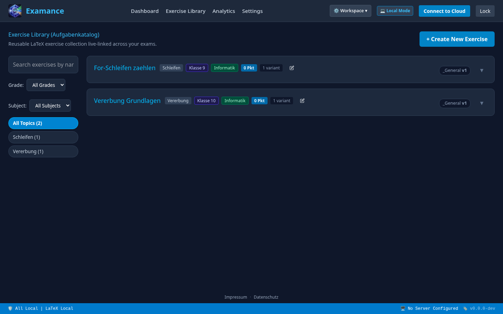
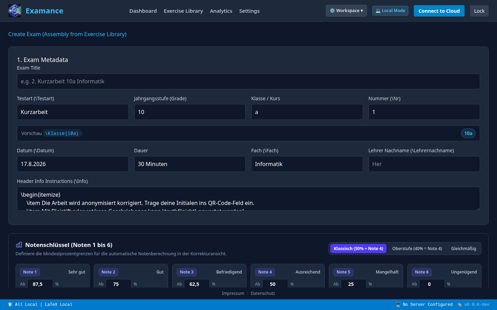
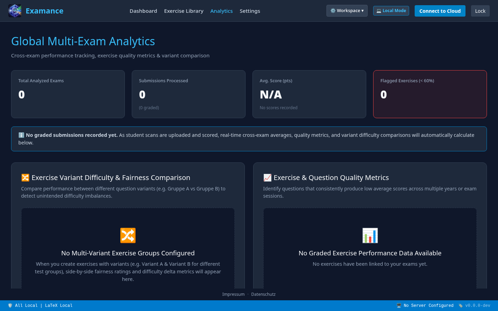
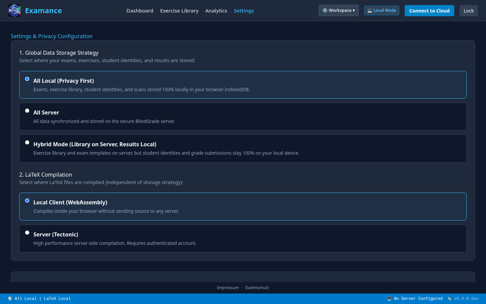

<!-- _class: title -->

# Examance

### Privacy-first, zero-knowledge-encrypted anonymous exam grading

No account required · Encrypted at rest · GDPR by design

---

## The problem in the teachers' lounge

| The workflow | The bias (halo effect) | Data protection |
|---|---|---|
| Manual correction, transcribing points into spreadsheets, and computing statistics eat into teachers' limited time. | A name on the cover sheet unconsciously influences grading before a single answer is read. | Mainstream cloud edtech tools are frequently a poor — sometimes illegal — fit for sensitive pupil data under GDPR/BDSG. |

**Examance addresses all three at once**: automates the mechanical parts of grading, structurally removes the student's identity from the corrector's view, and — by default — never sends sensitive data to a server at all.

---

## Getting started — no account required

Two entry points, changeable later in Settings: a fully local, offline-first workspace with **zero server dependency**, or a school-managed cloud account for cross-device sync. Either way, data is encrypted client-side (Argon2id → HKDF-SHA-256 → AES-256-GCM) before it is ever written to disk.

---

## Your exams at a glance

---

## Pillar 1 — Reusable exercise library & LaTeX authoring

Exercises live in a **shared, taggable library** (topic, grade, subject) instead of being copy-pasted between exam files each term. Each item is a LaTeX fragment with live PDF preview, automatic point-value parsing, and free-text / single-choice / multiple-choice support.

---

## Pillar 1 — Variants, versions, and exam assembly

The library groups exercises, tracks **variants** (anti-copying A/B/C phrasings of the same problem) and **versions** (fix history with diffing) — filterable by grade, subject, topic.

---

## Pillar 1 — Assembling the exam

Pick exercises from the library, configure the grading key (linear, *Oberstufe*-weighted, or custom cutoffs 1–6), and Examance renders a print-ready, QR-coded booklet locally via WASM XeLaTeX (Tectonic) — no source ever leaves the browser in local mode.

---

## Pillar 2 — Digital, anonymous correction

1. **Write** — students complete the printed, QR-coded exam with pen and paper.
2. **Scan** — the stack goes through the school scanner into a single PDF.
3. **Split & encrypt** — Examance splits by QR code and encrypts every page client-side.
4. **Grade** — on-screen pen/mouse annotation over the scan; originals stay untouched.

**Free-text**: teacher sees handwriting and answer — **not** the student's name.
**MC / SC**: WebAssembly optical-mark-recognition (OMR) auto-detects marks and applies penalty logic — no manual tallying.

---

## Pillar 3 — Didactic analytics, privacy-preserving

Score distributions, per-topic heatmaps for knowledge gaps, exercise/question quality metrics across years, variant-fairness comparisons, and CSV/XLSX export — all computed from the encrypted local vault, the same data that was never uploaded anywhere.

---

<!-- _footer: "" -->

## No compromises on data protection

- **All Local** *(default)* — encrypted entirely in the browser (IndexedDB), zero bytes reach a server. Export/import as a password-protected `.bgproj` archive.
- **All Server** — synced as **AES-256-GCM ciphertext**; the server never sees plaintext.
- **Hybrid** — shared exercise library on the server, identities & results stay local.

LaTeX compiles locally (WASM, nothing leaves the browser) or server-side. The local engine auto-routes around hardware limits: sequential rendering on low-spec/eco devices, multi-core/SIMD on capable machines.

---

<!-- _class: title -->

## Conclusion — value at every level

| For teachers | For students | For school leadership |
|---|---|---|
| Real time savings: automatic MC/SC scoring, reusable library, no manual grade tallying. | Guaranteed fairness — objective, anonymous grading via identity/answer decoupling. | Legal certainty: privacy-by-design, no compromise on GDPR / Bavarian school-law protection. |

**Examance** — Privacy-First Anonymous Exam Management
