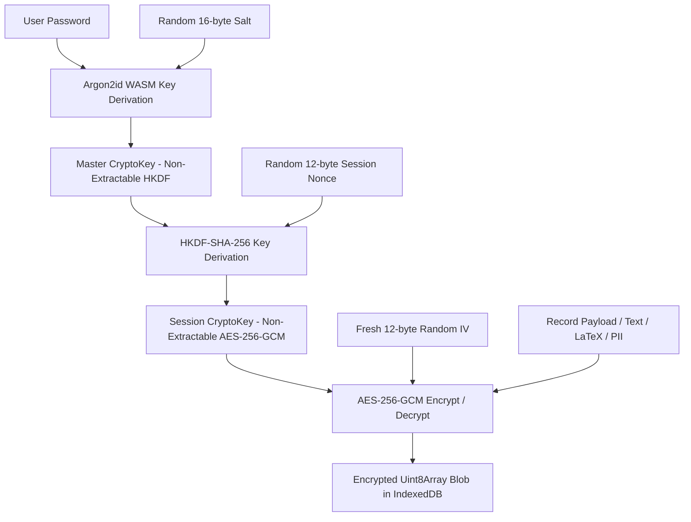

# Examance Data Flow, Encryption-at-Rest, & Security Architecture

This document describes the privacy-first data storage architecture, client-side encryption lifecycle, session hygiene, and DevTools zero-exposure security model implemented in **Examance**.

---

## 1. Overview & Security Invariants

Examance uses a zero-knowledge, client-side encryption-at-rest model designed to prevent unauthorized access to sensitive exam data, student PII, scan images, and grading scores—even when inspecting browser storage via Developer Tools.

### Core Invariants
1. **No Unauthenticated DevTools Access**: When a user is locked or logged out, browser DevTools inspection reveals **zero unencrypted text** (no LaTeX preamble/body, exam metadata, answer keys, fallback codes, or raw scores). Storage is either completely purged (`server-synced` mode) or stored as opaque AES-256-GCM binary ciphertexts (`local-only` mode).
2. **Key material is passphrase-derived and tab-scoped.** The master key is derived from a passphrase the user enters; **the passphrase itself is never persisted anywhere**. To survive an F5 reload, the derived `sessionKey` and master key bytes are written to **`sessionStorage`**, which is per-tab and cleared when the tab closes; they are also wiped on manual lock, on inactivity timeout, and on a lock broadcast from another tab. `localStorage` holds only the Argon2id salt, the session nonce, and non-secret UI state — never a key or a passphrase. **Nothing derived from the passphrase is written to IndexedDB.**

   *This is a deliberate trade of key exposure for usability: while a tab is unlocked, script running on the origin can read the session key out of `sessionStorage`. The alternative — re-prompting on every reload — was judged worse for the grading workflow. It also means the vault is only as private as the browser profile is: anyone who can run script on this origin, or who reaches an already-unlocked tab, can read the data.*

   *Earlier builds of the anonymous local mode generated a random password and stored it in `localStorage`, beside the IndexedDB it protected. That defeated encryption at rest entirely and has been removed; existing vaults are migrated on next unlock.*
3. **Data Loss Prevention**: Edits and grading annotations are protected against tab closing/reloading (`beforeunload`) and SvelteKit client-side SPA navigation (`beforeNavigate` via `sessionStore.isDirty`).

---

## 2. Key Derivation & Encryption Architecture

### Cryptographic Algorithms
* **Key Derivation (Master Key)**: Argon2id (`time=3, memory=64MB, parallelism=4, hashLen=32`). Where the Argon2 WASM module is unavailable, PBKDF2-HMAC-SHA-256 at 600,000 iterations is used instead (OWASP 2024 minimum). A decrypt-only path at the superseded 1,000-iteration parameter exists solely to open and re-encrypt vaults written before that increase.
* **Session Key Derivation**: HKDF-SHA-256 combining `masterKey` and a fresh 12-byte `sessionNonce`.
* **Symmetric Encryption**: AES-256-GCM with fresh 12-byte IV generated per operation via `crypto.getRandomValues`.

---

## 3. Data Storage Topology & Encryption-at-Rest

| Entity Table | Plaintext Index Fields | Encrypted Payload (`payloadCt` & `payloadIv`) | DevTools Exposure when Locked/Logged Out |
| :--- | :--- | :--- | :--- |
| `exams` | `id, teacherId, retentionUntil` | Title, LaTeX preamble, LaTeX template, info text, testart, klasse, datum, nr, fach, teacher name | Opaque Binary Ciphertext / Purged |
| `exercises` | `id, examId, topicTag, maxPoints` | Title, exercise name, LaTeX body, answer choices, correct answers | Opaque Binary Ciphertext / Purged |
| `examExercises` | `[examId+exerciseId], orderIndex` | N/A (UUID links only) | Standard IDB table |
| `students` | `pseudonymId, examId` | Fallback booklet code (`fallbackCode`), student PII (`piiCt`) | Opaque Binary Ciphertext / Purged |
| `submissions` | `id, examId, pseudonymHash` | Total score (`totalScore`), scan image blob (`scanCt`), annotations vector layer (`annotationCt`) | Opaque Binary Ciphertext / Purged |
| `exerciseScores` | `id, submissionId, exerciseId` | Score value (`score`), selected options | Opaque Binary Ciphertext / Purged |
| `auditLog` | `id, action, timestamp` | Action note details | Opaque Binary Ciphertext / Purged |

---

## 4. DevTools Security & Session Hygiene Lifecycle

---

## 5. Data Migration & Sync Sequence

---

## 6. Data Loss Prevention Guards

### Internal Route Navigation Interceptor
SvelteKit `beforeNavigate` in `+layout.svelte` checks `sessionStore.isDirty`:
- If `isDirty` is true when clicking navigation links, the user is prompted to confirm before leaving.
- Prevents accidental loss of unsaved exercise edits or exam configurations.

### Canvas Grading Annotation Guard
In `exam/[id]/grade/+page.svelte`:
- Drawn pen strokes (`currentStrokes`) are tracked in component state.
- Navigating between student booklets (`prevStudent()` / `nextStudent()`) prompts the user if unsaved canvas annotations exist.
- Saving updates `db.submissions` with encrypted `annotationCt` and resets dirty state.
