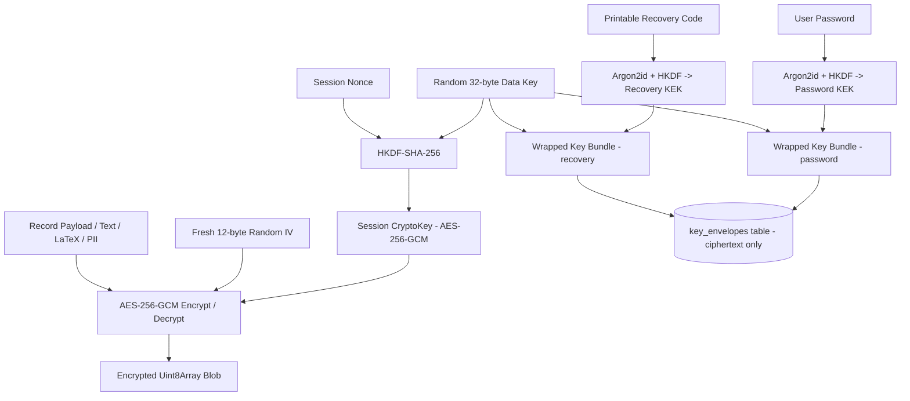
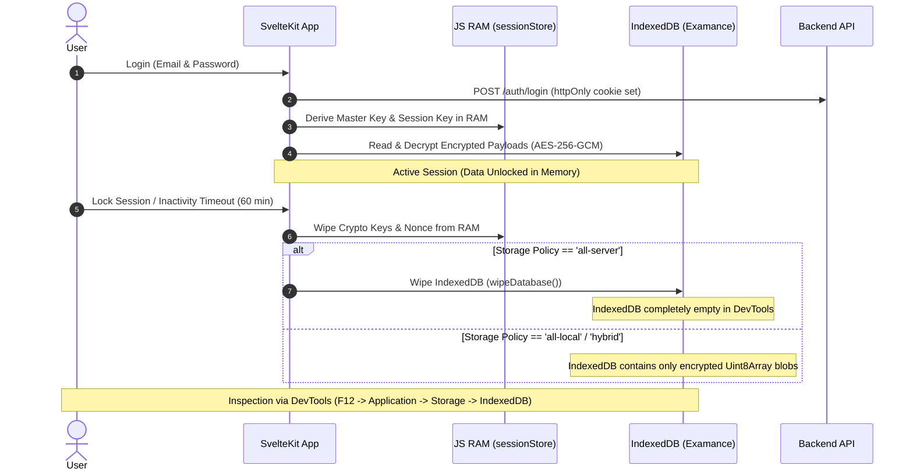

# Examance Data Flow, Encryption-at-Rest, & Security Architecture

This document describes the privacy-first data storage architecture, client-side encryption lifecycle, session hygiene, and DevTools zero-exposure security model implemented in **Examance**.

---

## 1. Overview & Security Invariants

Examance uses a zero-knowledge, client-side encryption-at-rest model designed to prevent unauthorized access to sensitive exam data, student PII, scan images, and grading scores—even when inspecting browser storage via Developer Tools.

### Core Invariants
1. **No Unauthenticated DevTools Access**: When a user is locked or logged out, browser DevTools inspection reveals **zero unencrypted text** (no LaTeX preamble/body, exam metadata, answer keys, fallback codes, or raw scores). Storage is either completely purged (`all-server` mode) or stored as opaque AES-256-GCM binary ciphertexts (`all-local` / `hybrid` mode).

   *Previously broken here (2026-08-17, now fixed):* `encryptStudent()` used to re-emit `fallbackCode`, `studentName` and `studentNumber` as plain properties next to the ciphertext it had just made of those same fields, `studentRepository.save()` persisted that record unchanged — and did so *before* the storage-mode check, so pupil names landed in local IndexedDB even in `all-server` mode — and `fallbackCode` was a plaintext Dexie index. Identity fields now exist only inside `payloadCt`; `encryptStudent()` refuses to write them at all without a key; the local write happens only outside `all-server` mode; and Dexie v9 drops the index and strips the columns from existing rows. Tracked as L17 in `legal_audit_dsgvo.md` §4.
2. **Key material is passphrase-derived and tab-scoped.** The master key is derived from a passphrase the user enters; **the passphrase itself is never persisted anywhere**. To survive an F5 reload, the derived `sessionKey` and master key bytes are written to **`sessionStorage`**, which is per-tab and cleared when the tab closes; they are also wiped on manual lock, on inactivity timeout, and on a lock broadcast from another tab. `localStorage` holds only the Argon2id salt, the session nonce, and non-secret UI state — never a key or a passphrase. **Nothing derived from the passphrase is written to IndexedDB.**

   *This is a deliberate trade of key exposure for usability: while a tab is unlocked, script running on the origin can read the session key out of `sessionStorage`. The alternative — re-prompting on every reload — was judged worse for the grading workflow. It also means the vault is only as private as the browser profile is: anyone who can run script on this origin, or who reaches an already-unlocked tab, can read the data.*

   *Earlier builds of the anonymous local mode generated a random password and stored it in `localStorage`, beside the IndexedDB it protected. That defeated encryption at rest entirely and has been removed; existing vaults are migrated on next unlock.*
3. **Data Loss Prevention**: Edits and grading annotations are protected against tab closing/reloading (`beforeunload`) and SvelteKit client-side SPA navigation (`beforeNavigate` via `sessionStore.isDirty`).

---

## 2. Key Derivation & Encryption Architecture

The data key is **random and wrapped**, not derived from the password. This is the
change that makes a password reset survivable: the key that opens the vault stays
the same across one, and only the wraps around it are rewritten.

### Key envelope

Each factor that may recover the data key derives a **key-encryption key** in the
browser and wraps its own copy. The server stores only ciphertext, a public
per-factor salt and public KDF parameters (`key_envelopes`,
`backend/app/routers/keys.py`); it never sees a password, a recovery code, or the
data key, so it cannot unwrap what it holds.

* **Wrapped payload** is a *bundle*, not a single key: `{dek, fallback, legacy}`.
  `decrypt()` walks primary → PBKDF2-600k → PBKDF2-1k, so a real vault can hold
  records that only open under a superseded key. All three are captured at
  migration, the one moment they exist together.
* **AAD** binds each wrap to `teacher_id | kind | key_id | envelope_version`, so a
  wrap cannot be replayed as a different factor or against a different key
  generation.
* **Fingerprint pinning.** AAD cannot stop a *server* that substitutes the whole
  envelope set — it would pick both sides. The client therefore pins a SHA-256 of
  the set in `localStorage` after the first successful unwrap and refuses a set it
  has not seen before.
* **Migration adopts, it does not re-key.** On an account created before the
  envelope, the first sign-in takes the key the old scheme derived and makes *that*
  the data key. Every existing ciphertext stays valid, the resulting session key is
  byte-identical to the previous one, and no re-encryption pass runs.
* **A server-side password write cannot re-wrap.** An admin reset or
  `cli.py set-password` marks the password wrap `invalidated_at`; the teacher then
  recovers with their recovery code on the next sign-in. An administrator cannot
  restore a teacher's data — by design.

### Cryptographic Algorithms
* **Key-encryption keys**: Argon2id (`time=3, memory=64MB, parallelism=4, hashLen=32`) over a **random 16-byte per-factor salt**, then HKDF-SHA-256 with a per-factor `info` string. Where the Argon2 WASM module is unavailable, PBKDF2-HMAC-SHA-256 at 600,000 iterations is used instead (OWASP 2024 minimum). A decrypt-only path at the superseded 1,000-iteration parameter exists solely to open vaults written before that increase.
* **Session Key Derivation**: HKDF-SHA-256 combining the data key and `sessionNonce`. For an authenticated account the nonce is derived from the email address — it is HKDF salt rather than a secret, and every record ever written was sealed under it.
* **Recovery code**: ~198 bits from `crypto.getRandomValues`, rendered in a Crockford-style base32 alphabet with `I`, `L`, `O` and `U` omitted because they are misread off paper. Shown exactly once.
* **Symmetric Encryption**: AES-256-GCM with fresh 12-byte IV generated per operation via `crypto.getRandomValues`.

### Sign-in factors

Every sign-in presents **two of three** factors: password, passkey, authenticator
(TOTP). A teacher who enrols all three survives losing any one of them, which is
the point — a hard second factor with no way back is a support incident waiting
to happen. `app/services/auth_policy.py` is the single place the rule lives.

Two rules, not one:

1. At least two factors enrolled. An account below that is held in an
   enrollment-scoped session and reaches nothing else.
2. At least one **key-capable** factor. An authenticator can prove who you are
   but cannot unwrap the data key — its secret is server-side and six digits
   carry no entropy to derive from. Without this rule an account could sign in
   and still not read its own exams.

Nothing is disclosed before a factor is proven. There is deliberately no endpoint
answering "which factors does this email have": that is an account-existence and
account-profile oracle. The list of remaining factors comes back only after the
first one succeeds. TOTP is second-position only, since a code identifies no
account and taking an email alongside it would rebuild the same oracle.

The token that carries a sign-in forward authenticates nothing but the next step:
ten-minute expiry, no refresh cookie, single use, and the second factor is checked
against the account named in the token rather than an email the caller supplies.

TOTP is RFC 6238 on the standard library, verified against the RFC's own test
vectors. Codes are accepted once — the highest accepted step is stored — so a code
seen over a shoulder inside its 30-second window cannot open a second sign-in.
Secrets are encrypted at rest under a key derived from `SECRET_KEY`; the server
must compute the expected code, so this is not zero-knowledge, but a database dump
alone yields no working seeds. **Rotating `SECRET_KEY` therefore invalidates every
enrollment.**

### Password reset

A reset re-establishes the password, so the password is unavailable by definition
and the emailed token stands in for it — as **one** of the two factors. Mailbox
access alone completing a reset is precisely the bypass this closes.

It also restores access to the teacher's *data*, not only their login. The data
key is unwrapped in the browser with the recovery code and re-wrapped under the
new password; nothing is re-encrypted. The new password and the matching key copy
are written in one transaction, because two round trips could leave an account
whose password changed and whose key copy did not — indistinguishable from a
working account until the next sign-in opens nothing.

A teacher without their recovery code can still reset: the account comes back, the
old ciphertext stays sealed, and the UI says so in those words before proceeding.
An account that never finished enrolling is the one case where the emailed token
carries the reset alone — it has no second factor to offer, and requiring one
would strand it.

### Login throttling

`POST /auth/login` is bounded twice. slowapi's existing limit is keyed on the
client IP, which stops a spray from one host but not a guesser rotating
addresses; `app/services/login_throttle.py` adds a failure counter keyed on the
*account*, stored in Redis under a SHA-256 of the email (so the store is not an
account listing) and mirrored onto `teachers.locked_until`.

The cooloff is exponential and **capped** (`LOGIN_LOCKOUT_MAX_SECONDS`, one hour
by default). That cap is a deliberate trade, not an oversight: any per-account
lockout hands someone who knows an address a denial-of-service against its owner,
so the lock always expires on its own and is never escalated by further attempts
once set.

An account that has no password set answers exactly like a wrong password. The
older, distinct response told an unauthenticated caller which addresses have
accounts here.

---

## 3. Data Storage Topology & Encryption-at-Rest

| Entity Table | Plaintext Index Fields | Encrypted Payload (`payloadCt` & `payloadIv`) | DevTools Exposure when Locked/Logged Out |
| :--- | :--- | :--- | :--- |
| `exams` | `id, teacherId, retentionUntil` | Title, LaTeX preamble, LaTeX template, info text, testart, klasse, datum, nr, fach, teacher name | Opaque Binary Ciphertext / Purged |
| `exercises` | `id, examId, topicTag, grade, subject, name, exerciseGroupId, variantKey, isCurrent` | Title, exercise name, LaTeX body, answer choices, correct answers | Opaque Binary Ciphertext / Purged |
| `examExercises` | `[examId+exerciseId], examId, exerciseId, orderIndex, mcGroupId` | N/A (UUID links only) | Standard IDB table |
| `examMcGroups` | `id, examId, orderIndex` | N/A — title, scoring text and order are layout metadata for MC-group LaTeX rendering only, not exercise content; see CLAUDE.md "Multiple Choice (MC) Data Model" | Standard IDB table |
| `students` | `pseudonymId, examId` | Student PII — `fallbackCode`, `studentName`, `studentNumber` (`payloadCt`) | Opaque Binary Ciphertext / Purged |
| `submissions` | `id, examId, pseudonymHash` | Total score (`totalScore`), scan image blob (`scanCt`), annotations vector layer (`annotationCt`) | Opaque Binary Ciphertext / Purged |
| `exerciseScores` | `id, submissionId, exerciseId` | Score value (`score`), selected options | Opaque Binary Ciphertext / Purged |
| `omrTemplates` | `id, examId` | Detected bubble/fiducial page rects (`OmrTemplatePayload.pages`), used for MC auto-grading | Opaque Binary Ciphertext / Purged |
| `exerciseResources` | `id, exerciseId, [exerciseId+filename]` | Raw file bytes (`dataCt`) of a teacher-uploaded LaTeX resource (image, PDF, data file). `filename`, `mimeType` and `byteSize` stay plaintext — they are index/display fields, not content | Opaque Binary Ciphertext / Purged |
| `auditLog` | `id, action, timestamp` | Action note details | Opaque Binary Ciphertext / Purged |

### Exercise resource files on the server

In `all-server` and `hybrid` mode an exercise's resource files are stored in the
`exercise_resources` table as **plaintext bytes**, exactly as `exercises.latex_body`
is plaintext there: an exercise kept on the server is server-readable by design,
and the Tectonic compiler cannot read ciphertext. The zero-knowledge path is the
default `all-local` mode, where the bytes never leave the browser except inline in
a server *compile* request, which writes them to a temp directory that is deleted
with the process.

While the exercise editor is open the files live under a throwaway staging id in the same
table and are committed onto the exercise (and uploaded, in server/hybrid mode) only when the
editor is saved; closing without saving deletes them.

Teachers are warned in the upload UI not to attach files containing personal data
of pupils. Resource files follow their exercise's lifecycle (`ON DELETE CASCADE`),
which — like exercises themselves — is outside the exam retention sweep.

---

## 4. DevTools Security & Session Hygiene Lifecycle

---

## 5. Data Migration & Sync Sequence

```mermaid
sequenceDiagram
    autonumber
    actor User
    participant Store as Local Storage Policy
    participant IDB as Local IndexedDB
    participant Server as Backend API

    rect rgb(30, 41, 59)
    note right of User: Local-to-Server Sync
    User->>Store: Switch to 'all-server'
    Store->>IDB: Read & Decrypt local records
    Store->>Server: POST /exams & /exercises
    Store->>Server: POST /exams/{id}/students (Client-encrypted PII)
    Store->>Server: POST /exams/{id}/submissions (Encrypted scans)
    end

    rect rgb(30, 41, 59)
    note right of User: Server-to-Local Purge
    User->>Store: Switch to 'all-local'
    Store->>User: Download encrypted .bgproj backup archive
    Store->>Server: POST /user/purge-server-student-data
    Server-->>Store: Soft-delete student data (7-day temporary retention)
    end
```

---

## 6. Data Loss Prevention Guards

### Internal Route Navigation Interceptor
SvelteKit `beforeNavigate` in `+layout.svelte` checks `sessionStore.isDirty`:
- If `isDirty` is true when clicking navigation links, the user is prompted to confirm before leaving.
- Prevents accidental loss of unsaved exercise edits or exam configurations.

### Canvas Grading Annotation Guard
In `exam/[id]/grade/+page.svelte`:
- Drawn pen strokes (`currentStrokes`) are tracked in component state.
- Navigating between student booklets (`prevStudent()` / `nextStudent()`) prompts the user if unsaved canvas annotations exist.
- Saving updates `db.submissions` with encrypted `annotationCt` and resets dirty state.
