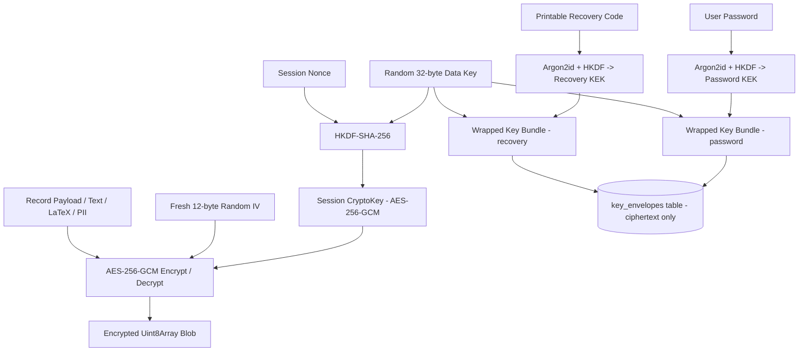
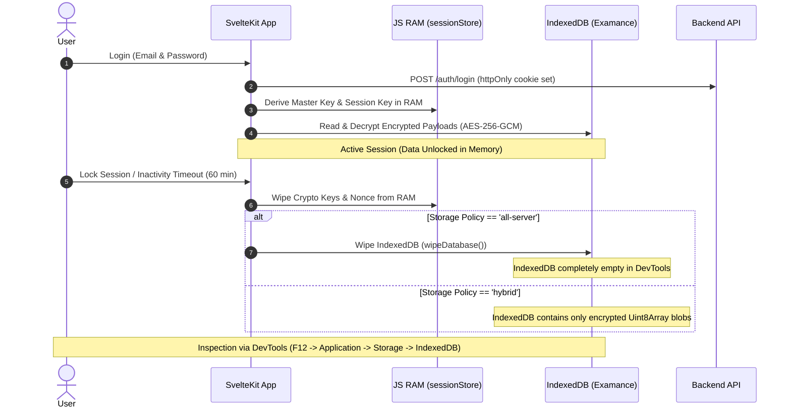
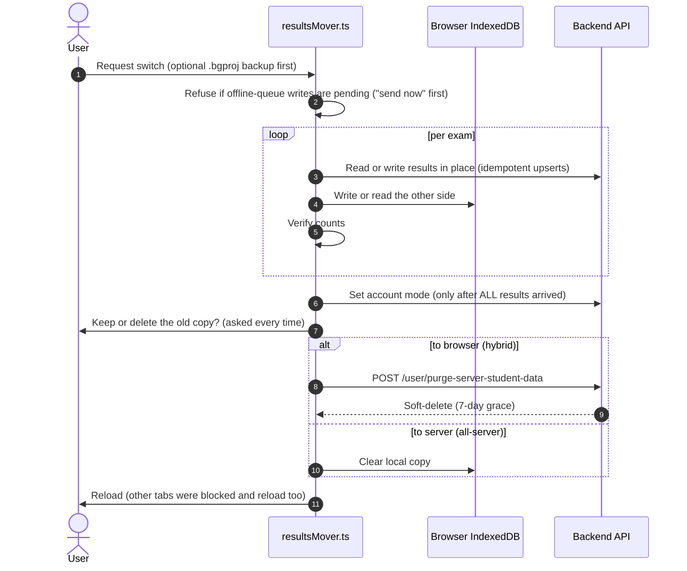

# Examance Data Flow, Encryption-at-Rest, & Security Architecture

This document describes the privacy-first data storage architecture, client-side encryption lifecycle, session hygiene, and DevTools zero-exposure security model implemented in **Examance**.

---

## 1. Overview & Security Invariants

Examance uses a zero-knowledge, client-side encryption-at-rest model designed to prevent unauthorized access to sensitive exam data, student PII, scan images, and grading scores—even when inspecting browser storage via Developer Tools.

### Core Invariants
1. **No Unauthenticated DevTools Access**: When a user is locked or logged out, browser DevTools inspection reveals **zero unencrypted text** (no LaTeX preamble/body, exam metadata, answer keys, fallback codes, or raw scores). Storage is either completely purged (`all-server` mode) or stored as opaque AES-256-GCM binary ciphertexts (`hybrid` mode, where student data, submissions and scores live only in the browser).

   *Previously broken here (2026-08-17, now fixed):* `encryptStudent()` used to re-emit `fallbackCode`, `studentName` and `studentNumber` as plain properties next to the ciphertext it had just made of those same fields, `studentRepository.save()` persisted that record unchanged — and did so *before* the storage-mode check, so pupil names landed in local IndexedDB even in `all-server` mode — and `fallbackCode` was a plaintext Dexie index. Identity fields now exist only inside `payloadCt`; `encryptStudent()` refuses to write them at all without a key; the local write happens only outside `all-server` mode; and Dexie v9 drops the index and strips the columns from existing rows. Tracked as L17 in `legal_audit_dsgvo.md` §4.
2. **Key material is tab-scoped.** Every user has a server account; the data key is unwrapped in the browser from the password the user enters (or another factor, §2), and **the password itself is never persisted anywhere**. There are no local passphrase vaults any more: the `all-local` mode was discontinued with issue #47. To survive an F5 reload, the derived `sessionKey` and master key bytes are written to **`sessionStorage`**, which is per-tab and cleared when the tab closes; they are also wiped on manual lock, on inactivity timeout, and on a lock broadcast from another tab. `localStorage` holds only the Argon2id salt, the session nonce, and non-secret UI state (e.g. language, the storage-mode boot cache `bg_storage_policy`, the MC-detection thresholds in `bg_omr_settings`) — never a key or a password. **Nothing derived from the password is written to IndexedDB.**

   *This is a deliberate trade of key exposure for usability: while a tab is unlocked, script running on the origin can read the session key out of `sessionStorage`. The alternative — re-prompting on every reload — was judged worse for the grading workflow. It also means the vault is only as private as the browser profile is: anyone who can run script on this origin, or who reaches an already-unlocked tab, can read the data.*

   *Earlier builds of the anonymous local mode generated a random password and stored it in `localStorage`, beside the IndexedDB it protected. That defeated encryption at rest entirely. The whole local mode has since been discontinued; see "Legacy local data" in §5.*
3. **Data Loss Prevention**: Edits and grading annotations are protected against tab closing/reloading (`beforeunload`) and SvelteKit client-side SPA navigation (`beforeNavigate` via `sessionStore.isDirty`).

---

## 2. Key Derivation & Encryption Architecture

The data key is **random and wrapped**, not derived from the password. This is the
change that makes a password reset survivable: the key that opens the vault stays
the same across one, and only the wraps around it are rewritten.

```mermaid
flowchart TD
    DEK[Random 32-byte Data Key] --> HKDF[HKDF-SHA-256]
    Nonce[Session Nonce] --> HKDF
    HKDF --> SessionKey[Session CryptoKey - AES-256-GCM]

    SessionKey --> AESGCM[AES-256-GCM Encrypt / Decrypt]
    FreshIV[Fresh 12-byte Random IV] --> AESGCM
    RecordPayload[Record Payload / Text / LaTeX / PII] --> AESGCM
    AESGCM --> CiphertextPayload[Encrypted Uint8Array Blob]

    Password[User Password] --> PwKEK[Argon2id + HKDF -> Password KEK]
    RecoveryCode[Printable Recovery Code] --> RcKEK[Argon2id + HKDF -> Recovery KEK]
    PwKEK --> WrapPw[Wrapped Key Bundle - password]
    RcKEK --> WrapRc[Wrapped Key Bundle - recovery]
    DEK --> WrapPw
    DEK --> WrapRc
    WrapPw --> Server[(key_envelopes table - ciphertext only)]
    WrapRc --> Server
```

### Key envelope

Each factor that may recover the data key derives a **key-encryption key** in the
browser and wraps its own copy. The server stores only ciphertext, a public
per-factor salt and public KDF parameters (`key_envelopes`,
`backend/app/routers/keys.py`); it never sees a password, a recovery code, or the
data key, so it cannot unwrap what it holds.

* **Wrapped payload** is a *bundle*, not a single key: `{dek, fallback, legacy}`.
  `decrypt()` walks primary → PBKDF2-600k → PBKDF2-1k, so a real vault can hold
  records that only open under a superseded key. All three are captured at
  migration, the one moment they exist together.
* **AAD** binds each wrap to `teacher_id | kind | key_id | envelope_version`, so a
  wrap cannot be replayed as a different factor or against a different key
  generation.
* **Fingerprint pinning.** AAD cannot stop a *server* that substitutes the whole
  envelope set — it would pick both sides. The client therefore pins a SHA-256 of
  the set in `localStorage` after the first successful unwrap and refuses a set it
  has not seen before.
* **Migration adopts, it does not re-key.** On an account created before the
  envelope, the first sign-in takes the key the old scheme derived and makes *that*
  the data key. Every existing ciphertext stays valid, the resulting session key is
  byte-identical to the previous one, and no re-encryption pass runs.
* **A server-side password write cannot re-wrap.** An admin reset or
  `cli.py set-password` marks the password wrap `invalidated_at`; the teacher then
  recovers with their recovery code on the next sign-in. An administrator cannot
  restore a teacher's data — by design.

### Cryptographic Algorithms
* **Key-encryption keys**: Argon2id (`time=3, memory=64MB, parallelism=4, hashLen=32`) over a **random 16-byte per-factor salt**, then HKDF-SHA-256 with a per-factor `info` string. Where the Argon2 WASM module is unavailable, PBKDF2-HMAC-SHA-256 at 600,000 iterations is used instead (OWASP 2024 minimum). A decrypt-only path at the superseded 1,000-iteration parameter exists solely to open vaults written before that increase.
* **Session Key Derivation**: HKDF-SHA-256 combining the data key and `sessionNonce`. For an authenticated account the nonce is derived from the email address — it is HKDF salt rather than a secret, and every record ever written was sealed under it.
* **Recovery code**: ~198 bits from `crypto.getRandomValues`, rendered in a Crockford-style base32 alphabet with `I`, `L`, `O` and `U` omitted because they are misread off paper. Shown exactly once.
* **Symmetric Encryption**: AES-256-GCM with fresh 12-byte IV generated per operation via `crypto.getRandomValues`.

### Sign-in factors

A sign-in needs **a passkey alone, or two of three** factors: password, passkey,
authenticator (TOTP). The passkey stands alone because every ceremony requires
user verification — possession plus a local biometric or PIN
(`SELF_SUFFICIENT_FACTORS`); password and TOTP never complete a sign-in by
themselves. Signing in with only a passkey changes nothing about the keys: the
PRF wrap yields the same data key, and the session key is derived exactly as
after a password sign-in. A password the server has not just accepted (e.g. the
vault prompt after a non-PRF passkey sign-in) may unwrap an existing envelope
but never runs the one-time migration, which would otherwise seal a key derived
from an unchecked password as the data key. A teacher who enrols all three survives losing any one of them, which is
the point — a hard second factor with no way back is a support incident waiting
to happen. `app/services/auth_policy.py` is the single place the rule lives.

Two rules, not one:

1. At least two factors enrolled. An account below that is held in an
   enrollment-scoped session and reaches nothing else.
2. At least one **key-capable** factor. An authenticator can prove who you are
   but cannot unwrap the data key — its secret is server-side and six digits
   carry no entropy to derive from. Without this rule an account could sign in
   and still not read its own exams.

Nothing is disclosed before a factor is proven. There is deliberately no endpoint
answering "which factors does this email have": that is an account-existence and
account-profile oracle. The list of remaining factors comes back only after the
first one succeeds. TOTP is second-position only, since a code identifies no
account and taking an email alongside it would rebuild the same oracle.

The token that carries a sign-in forward authenticates nothing but the next step:
ten-minute expiry, no refresh cookie, single use, and the second factor is checked
against the account named in the token rather than an email the caller supplies.

TOTP is RFC 6238 on the standard library, verified against the RFC's own test
vectors. Codes are accepted once — the highest accepted step is stored — so a code
seen over a shoulder inside its 30-second window cannot open a second sign-in.
Secrets are encrypted at rest under a key derived from `SECRET_KEY`; the server
must compute the expected code, so this is not zero-knowledge, but a database dump
alone yields no working seeds. **Rotating `SECRET_KEY` therefore invalidates every
enrollment.**

### Passkeys

A passkey is the third factor. The ceremonies use `py_webauthn` rather than a
hand-rolled parser — attestation objects are CBOR/COSE, and hand-rolled parsers
for those are how relying parties get CVEs.

Registration requires at least an enrollment-scoped session; authentication
requires none, which is the point of a first-position factor. The ceremony takes
no account identifier: the credential is discoverable, so the authenticator names
the account, and asking the server which passkeys an email has would rebuild the
oracle the rest of the design avoids. A passkey contributes exactly one factor
whether it is presented first or second.

Where the authenticator implements the **PRF extension**, the passkey is also
key-capable: the browser derives a secret inside the authenticator that never
leaves the device, and that secret wraps a copy of the data key. `prf_salt` — 32
public bytes fixed at registration — is the PRF *input*, not its output, which is
why storing it server-side gives nothing away. Where PRF is unavailable the
passkey signs in and nothing more; `supports_prf` records that and the settings
panel says so, because a teacher who assumes otherwise ends up with an account
they can reach and exams they cannot read.

`sign_count` is stored and checked: a counter that goes backwards is the spec's
clone signal. A constant `0` means the authenticator does not count at all, which
most platform ones do not, so only a *decrease from a non-zero value* is rejected.

**Relying-party ID is per stack.** `WEBAUTHN_RP_ID` defaults to the `FRONTEND_URL`
host. Production and preview are different registrable domains, so a passkey
registered against one will not work against the other and each stack needs its
own enrollments. That is WebAuthn, not something configuration can paper over.

### Password reset

A reset re-establishes the password, so the password is unavailable by definition
and the emailed token stands in for it — as **one** of the two factors. Mailbox
access alone completing a reset is precisely the bypass this closes.

It also restores access to the teacher's *data*, not only their login. The data
key is unwrapped in the browser with the recovery code and re-wrapped under the
new password; nothing is re-encrypted. The new password and the matching key copy
are written in one transaction, because two round trips could leave an account
whose password changed and whose key copy did not — indistinguishable from a
working account until the next sign-in opens nothing.

A teacher without their recovery code can still reset: the account comes back, the
old ciphertext stays sealed, and the UI says so in those words before proceeding.
An account that never finished enrolling is the one case where the emailed token
carries the reset alone — it has no second factor to offer, and requiring one
would strand it.

### Login throttling

`POST /auth/login` is bounded twice. slowapi's existing limit is keyed on the
client IP, which stops a spray from one host but not a guesser rotating
addresses; `app/services/login_throttle.py` adds a failure counter keyed on the
*account*, stored in Redis under a SHA-256 of the email (so the store is not an
account listing) and mirrored onto `teachers.locked_until`.

The cooloff is exponential and **capped** (`LOGIN_LOCKOUT_MAX_SECONDS`, one hour
by default). That cap is a deliberate trade, not an oversight: any per-account
lockout hands someone who knows an address a denial-of-service against its owner,
so the lock always expires on its own and is never escalated by further attempts
once set.

An account that has no password set answers exactly like a wrong password. The
older, distinct response told an unauthenticated caller which addresses have
accounts here.

### Account registration and approval

Accounts come from an admin invitation, the CLI or bootstrap, or, when the operator turns it on (`REGISTRATION_ENABLED`, off by default, issue #53), self-registration. The operator guide is `account_creation_and_management.md` §7; this is the security shape.

**Flow.** `POST /auth/register {email}` mails a single-use link, `POST /auth/register/complete {token, new_password, note?}` creates the account with the password the registrant chose. An address whose domain is on the admin's allowlist (`allowed_email_domains`, exact match on the part after `@`) is approved on the spot with that domain's features; any other account is **pending** (`teachers.approved_at` is NULL) until an admin approves it. The registration touches no key material: there is no key envelope until the first sign-in, when the browser creates the data key and the recovery code as for any new account.

**Where it lives.**

| Table / column | Holds | Personal data? |
| :--- | :--- | :--- |
| `registration_requests` | E-mail address in plaintext, SHA-256 of the 32-byte random token, expiry, last-sent time. One row per address, until the link is used, replaced or expired (`REGISTRATION_TOKEN_TTL_HOURS`, default 24). | Yes (address) |
| `teachers.approved_at` | NULL = pending. No default, deliberately: a write path that forgets it fails closed. Migration `0028` backfilled existing accounts with `created_at`. | Account metadata |
| `teachers.registration_note` | Optional free text (up to 500 characters) for the approving admin. Erased on approval; never stored for an allowlisted address; never put in a mail. | Yes (free text) |
| `teachers.allow_server_results`, `allow_server_latex` | The per-account feature switches (§5). | Account metadata |
| `allowed_email_domains` | The admin's always-allowed domains and their features. | No |

Until the link is used no `teachers` row exists, so that table holds verified addresses only.

**The approval gate.** A pending account holds no token of any kind: not a session, not an enrollment token, not a reset token. `advance_sign_in`, which every factor endpoint (passkey included) goes through, answers `approval_pending` with no cookie. As defence in depth `get_current_teacher`, `get_pending_teacher` and `POST /auth/refresh` refuse an unapproved account, `POST /auth/forgot-password` sends it nothing, and reset tokens are refused for it.

**No account-existence oracle.** The rule of §2 holds here too. `POST /auth/register` always answers `202` with the same message and sends no mail for an address that already has an account; the mail is sent from a background task after the response, so the response time does not tell either (`/auth/forgot-password` was changed the same way, since awaiting SMTP in the request made an existing address measurably slower). Sign-in answers `approval_pending` only after a factor (the password) was proven; a wrong password for a pending account is the same `401 ERR_INVALID_CREDENTIALS` as for an unknown one, so knowing an address teaches nothing.

**Abuse limits.** Both public endpoints are limited to 20 per hour per IP; a verification mail to the same address is sent at most every `REGISTRATION_RESEND_COOLDOWN_SECONDS` (default 300), and a new link invalidates the old; the admin notice mail carries only a count and a link, never the registrant's address or note, and is skipped when another pending account arrived within the last 15 minutes. An unapproved account can create nothing: it has no token to do so. The allowlist is a trust decision of the admin: listing a public mail provider would approve everyone at it, so the Admin UI warns against it; entries match exactly (no subdomains, no wildcards), and a change never touches existing accounts.

**Retention.** The retention job deletes expired `registration_requests` rows and pending accounts older than `PENDING_ACCOUNT_RETENTION_DAYS` (default 90). Only a plain `teacher` account with no exam, exercise or key envelope qualifies. The audit row is `USER_REJECTED` with the actor `system:retention-cron` and a hash of the account id, never the address. Admin rejection deletes the account at once.

**Limit: a pending registrant has no session**, so they cannot use the in-app export or deletion (`/user/me/export`, `DELETE /user/me`). Their data is the address, a password hash and an optional note; a request under Art. 15 or 17 goes to the operator, and rejecting the registration (or the 90-day purge) erases it. See R14 in `dpia_art35.md`.

**Audit.** `USER_REGISTERED`, `USER_APPROVED` (actor `system:allowed-domain` for an automatic approval), `USER_REJECTED`, `USER_FEATURES_CHANGED`, `ALLOWED_DOMAIN_ADDED`, `ALLOWED_DOMAIN_CHANGED`, `ALLOWED_DOMAIN_REMOVED`. Migration `0028` also adds `PASSWORD_CHANGED` to the audit enum: `/auth/change-password` had been writing it without it ever being a member, which PostgreSQL rejects.

---

## 3. Data Storage Topology & Encryption-at-Rest

| Entity Table | Plaintext Index Fields | Encrypted Payload (`payloadCt` & `payloadIv`) | DevTools Exposure when Locked/Logged Out |
| :--- | :--- | :--- | :--- |
| `exams` | `id, teacherId, retentionUntil` | Title, LaTeX preamble, LaTeX template, info text, testart, klasse, datum, nr, fach, teacher name | Opaque Binary Ciphertext / Purged |
| `exercises` | `id, examId, topicTag, grade, subject, name, exerciseGroupId, variantKey, isCurrent` | Title, exercise name, LaTeX body, answer choices, correct answers | Opaque Binary Ciphertext / Purged |
| `examExercises` | `[examId+exerciseId], examId, exerciseId, orderIndex, mcGroupId` | N/A (UUID links only) | Standard IDB table |
| `examMcGroups` | `id, examId, orderIndex` | N/A — title, scoring text and order are layout metadata for MC-group LaTeX rendering only, not exercise content; see CLAUDE.md "Multiple Choice (MC) Data Model" | Standard IDB table |
| `students` | `pseudonymId, examId` | Student PII — `fallbackCode`, `studentName`, `studentNumber` (`payloadCt`) | Opaque Binary Ciphertext / Purged |
| `submissions` | `id, examId, pseudonymHash` | Total score (`totalScore`), scan image blob (`scanCt`), annotations vector layer (`annotationCt`) | Opaque Binary Ciphertext / Purged |
| `exerciseScores` | `id, submissionId, exerciseId` | Score value (`score`), selected options, OMR metadata (`omrMeta`: detection result, per-bubble raw fill ratios and immutable detector state, page alignment stats, and the `run` snapshot — detection time, settings and algorithm version used) | Opaque Binary Ciphertext / Purged |
| `omrTemplates` | `id, examId` | Detected bubble/fiducial page rects (`OmrTemplatePayload.pages`), used for MC auto-grading | Opaque Binary Ciphertext / Purged |
| `exerciseResources` | `id, exerciseId, [exerciseId+filename]` | Raw file bytes (`dataCt`) of a teacher-uploaded LaTeX resource (image, PDF, data file). `filename`, `mimeType` and `byteSize` stay plaintext — they are index/display fields, not content | Opaque Binary Ciphertext / Purged |
| `auditLog` | `id, action, timestamp` | Action note details | Opaque Binary Ciphertext / Purged |

*Previously broken here (2026-10-03, now fixed):* in the then-existing `all-local` mode, creating an exercise variant in the library (`handleSaveVariant()`, `routes/exercises/+page.svelte`) wrote the new variant, and the base exercise it had just tagged with a group id, to `exercises` without `encryptExercise()`. Name, LaTeX body and answer choices sat in IndexedDB in plaintext. Both writes are now sealed. Rows already affected are re-sealed the next time the library loads under a key (`sealPlaintextRows()` in `exerciseRepository.ts`). This was teacher-authored exercise content on the teacher's own device, not student data, and nothing left the device.

*What the table means per location.* It describes the browser representation (IndexedDB). On the server, everything above is client-side encrypted **except** the LaTeX of exams and exercises and `total_score`, which are plaintext there (see below). In `all-server` mode IndexedDB is only a purged-on-lock cache; in `hybrid` mode `students`, `submissions` and `exerciseScores` exist only in IndexedDB.

### Per-exercise scores on the server

In `all-server` mode, per-exercise results live in the server's
`exercise_scores` table (migration `0021`). Until that table existed they had no
server home at all: `saveScoreEncrypted()` wrote straight to IndexedDB in every
mode, and `lockSession()` wipes IndexedDB in `all-server` mode — so grading an
exam on the server and leaving it for the 60-minute idle timeout destroyed every
per-question score, MC selection and OMR result. Only the submission's
`total_score` survived, because that one has a column.

Unlike `scan_submissions.total_score`, there is **no plaintext score column**.
Score, `selectedOptions` and `omrMeta` are sealed client-side into one
AES-256-GCM payload (`encryptScore`, `lib/db/dbEncryption.ts`) and the server
stores only that blob plus the two foreign keys. A per-question plaintext record
of how a named pupil answered each item reconstructs the answer sheet, which is
a sharper disclosure than an exam total; statistics that need a number use
`total_score`.

Since issue #32, `omrMeta` also carries the raw per-bubble readings (fill ratio,
redo-zone ratio, the detector's own state) and a snapshot of the detection
settings each row was produced with. That is pupil-derived answer-sheet data
and stays inside the same sealed payload: no plaintext column, no index, no log
line. It is erased with the pupil and by retention like the rest of the row. It
exists so a future calibration can learn from teacher verification; any such
learning must run client-side and keep only aggregate thresholds, never
per-pupil samples, and must not remove the human review step (DPIA Art. 22
assumption, `dpia_art35.md`).

`hybrid` keeps scores local, like submissions and student identities — they are
grading results, and that is the axis hybrid mode splits on. In hybrid mode such
results are visible only in the browser that recorded them; the `.bgproj` archive
(§5) is the backup.

### Training-data donation (opt-in)

Off by default; toggled per browser in Settings ("5. MC-Erkennung verbessern
(freiwillig)", `localStorage` key `bg_omr_donation`, versioned — consent v2), and
only active while the teacher is signed in to a server account. When on, after
a teacher verifies or corrects an MC question in the verification view, the
browser sends, per box, one small 80×48 grayscale crop (the box and the
correction field next to it — no question text), the verified label (ticked /
not ticked), the detector's own reading, its numeric features, the
algorithm/schema version and a random per-box `sample_token` to
`POST /api/v1/training/omr-samples` on the operator's own configured backend.
Switching the option off, or signing out, drops everything not yet sent.

**Authenticated, stored unlinked.** The endpoint requires a full session, so only
accounts of the installation (approved by an admin, or from a domain an admin allow-listed, and so holding no token before that) can write into the production
database. The account is used for a per-account daily quota
(`TRAINING_SAMPLES_PER_TEACHER_PER_DAY`, counter keyed by a SHA-256 of the
account id in the ephemeral store, expiring with the day) and nothing else: no
teacher column, no audit entry, no log line. A global daily cap
(`TRAINING_SAMPLES_PER_DAY_MAX`, counted in the database) is the backstop. Quota
answers are 429 without `Retry-After`. The server therefore *knows* which account
donates while the request runs; what it keeps is unlinked.

**Not sent**: names, pseudonyms, exam/submission/question ids, or timestamps
finer than day granularity. The `sample_token` is random, generated in the
browser and kept only in the sealed score row; it lets a re-donation after a
corrected label replace the earlier row instead of leaving a contradicting one.
Server-side, the `omr_training_samples` table (migrations `0022`, `0023`) has no
foreign keys, no teacher and no IP column; each row's `created_on` is
day-granular. Retention is `TRAINING_SAMPLE_RETENTION_DAYS` (default 730 days),
enforced by the retention job and reported by the public `GET /training/status`
for the privacy notice; a kill switch `TRAINING_DONATION_ENABLED` can disable the
endpoint server-wide. An operator can export the dataset via
`python -m app.cli training-export --out samples.jsonl`.

Purpose: train a shared checkbox classifier so a fresh installation gets good
MC detection immediately, instead of starting from the built-in heuristics
alone. Risks and mitigations: re-identification of a donated crop (mitigated by
the tight crop and the absence of any stored id/account/IP) and dataset
poisoning or storage exhaustion (mitigated by requiring an account, the
per-account and global daily quotas, strict request validation
(`extra="forbid"`), consistency filtering applied at training time, and the
kill switch). In `hybrid` mode this is the only
path by which student-derived data reaches a server for *storage* (apart from
the account's own mode data); see the qualifier on server compilation below and
`scanning.s4.p4` in the in-app help.

**Server compilation is processing, not storage.** With "LaTeX Server" enabled, a
compile sends the exam's full LaTeX source (including solution variants) and its
resource files to `POST /compile/latex`; it is compiled in a temp directory that
is deleted afterwards, and neither persisted nor logged. Student data is never part
of a compile request. It requires a sign-in and the `server_latex` capability of the account (§5; the server answers `403 ERR_FEATURE_NOT_ALLOWED` without it), and
enabling it asks for consent once (`storagePolicy.serverCompileConsent`). The choice is a per-browser preference, independent of the storage mode.

### Exercise resource files on the server

In both remaining modes (`all-server` and `hybrid`) an exercise's resource files are stored in the
`exercise_resources` table as **plaintext bytes**, exactly as `exercises.latex_body`
is plaintext there: an exercise kept on the server is server-readable by design,
and the Tectonic compiler cannot read ciphertext. Resource files of exercises that are
not on the server never leave the browser except inline in
a server *compile* request, which writes them to a temp directory that is deleted
with the process — and except the opt-in, anonymised MC training-data donation
described above, which is off by default and independent of storage mode.

While the exercise editor is open the files live under a throwaway staging id in the same
table and are committed onto the exercise (and uploaded, in server/hybrid mode) only when the
editor is saved; closing without saving deletes them.

Teachers are warned in the upload UI not to attach files containing personal data
of pupils. Resource files follow their exercise's lifecycle (`ON DELETE CASCADE`),
which — like exercises themselves — is outside the exam retention sweep.

### Exam logos on the server

The logo printed in the exam header (issue #46) is stored as **plaintext bytes** like resource
files, for the same reason (Tectonic compiles it): `teacher_logos` holds an account's deviation
from the default (`none`, or its own file), `exam_logos` an exam's deviation from its account.
Without a `teacher_logos` row an account prints the bundled default logo (MTG,
`latex-assets/img/logo_mtg.pdf`), which every exam printed before logos were configurable;
resetting deletes the row. Only PNG, JPEG and PDF are accepted, detected from the magic bytes, at
most 2 MB; they are served back only to their owner with `nosniff` and a sandbox CSP. A logo is
school branding, not personal data of pupils. It follows its owner's lifecycle (`ON DELETE
CASCADE` from the account or exam) and is part of the account export (`GET /user/me/export`, with
the files base64-encoded: the account's setting and own file, each exam's setting and own file)
and of `.bgproj` archives (see Archives).

---

## 4. DevTools Security & Session Hygiene Lifecycle

```mermaid
sequenceDiagram
    autonumber
    actor User
    participant Page as SvelteKit App
    participant Memory as JS RAM (sessionStore)
    participant IDB as IndexedDB (Examance)
    participant Server as Backend API

    User->>Page: Login (Email & Password)
    Page->>Server: POST /auth/login (httpOnly cookie set)
    Page->>Memory: Derive Master Key & Session Key in RAM
    Page->>IDB: Read & Decrypt Encrypted Payloads (AES-256-GCM)

    Note over Page,IDB: Active Session (Data Unlocked in Memory)

    User->>Page: Lock Session / Inactivity Timeout (60 min)
    Page->>Memory: Wipe Crypto Keys & Nonce from RAM
    alt Storage Policy == 'all-server'
        Page->>IDB: Wipe IndexedDB (wipeDatabase())
        Note over IDB: IndexedDB completely empty in DevTools
    else Storage Policy == 'hybrid'
        Note over IDB: IndexedDB contains only encrypted Uint8Array blobs
    end

    Note over User,IDB: Inspection via DevTools (F12 -> Application -> Storage -> IndexedDB)
```

---

## 5. Storage Modes, Data Migration & Sharing

Two storage modes remain (issue #47). The `all-local` mode and the local
passphrase login (no account) were **discontinued**: every user signs in with a
server account.

* `all-server`: exams, exercises **and results** (students, submissions with
  scans, scores) live on the server. Everything is client-side encrypted except
  the LaTeX of exams/exercises and `total_score`.
* `hybrid`: exams and exercises live on the server; student data, submissions,
  scans and scores live only in this browser, encrypted in IndexedDB.

**The mode belongs to the account.** It is stored on the server
(`teachers.storage_mode`) and has no default: on first sign-in the user must
choose in a non-dismissible settings modal, and every browser of the account
follows it. The manifest row in IndexedDB (`lib/db/workspace.ts`) and the
`bg_storage_policy` boot cache mirror it; `commitStorageMode(mode, token)` accepts
only a token armed by the workspace layer. Which modes and features an account
may use comes from `GET /user/capabilities` (`backend/app/services/capabilities.py`).
An admin sets two switches per account (issue #53), and both are enforced:

* `server_results`: the `all-server` mode is allowed (`hybrid` always is). The
  server refuses result *writes* (students, submissions, scores, restore) with
  `403 ERR_FEATURE_NOT_ALLOWED` for an account that has the switch off and is not
  currently in `all-server`; reads and deletes are never refused, because the
  move and erasure need them.
* `server_latex`: server-side LaTeX compilation (`POST /compile/latex`,
  `POST /exams/{id}/compile`); without it the app compiles in the browser.

Exams and exercises always live on the server and have no switch. An account whose
stored mode is no longer allowed opens in `needs-choice`, and the choice moves its
results into the browser first (`docs/dev/storage_modes.md`); nothing is lost and
nothing is deleted by the revocation itself.

```mermaid
sequenceDiagram
    autonumber
    actor User
    participant Mover as resultsMover.ts
    participant IDB as Browser IndexedDB
    participant Server as Backend API

    User->>Mover: Request switch (optional .bgproj backup first)
    Mover->>Mover: Refuse if offline-queue writes are pending ("send now" first)
    loop per exam
        Mover->>Server: Read or write results in place (idempotent upserts)
        Mover->>IDB: Write or read the other side
        Mover->>Mover: Verify counts
    end
    Mover->>Server: Set account mode (only after ALL results arrived)
    Mover->>User: Keep or delete the old copy? (asked every time)
    alt to browser (hybrid)
        Mover->>Server: POST /user/purge-server-student-data
        Server-->>Mover: Soft-delete (7-day grace)
    else to server (all-server)
        Mover->>IDB: Clear local copy
    end
    Mover->>User: Reload (other tabs were blocked and reload too)
```

**Fluent move instead of a gate.** The earlier flow (forced export, wipe,
re-import) is gone. `resultsMover.ts` moves results in place, per exam, with
idempotent upserts and count verification. The account's mode changes only after
every result has arrived, so an interrupted move leaves the old mode and its
data intact and can be repeated. Afterwards the user decides each time whether to
keep or delete the old copy; the server copy is soft-deleted with the existing
7-day temporary retention. A move is refused while offline-queue writes are
pending, and other tabs are blocked during it. An `all-server` browser that still
holds local results (a former hybrid browser) shows a banner offering to upload
them; in `hybrid` mode a browser without results shows a hint that results live
only in the browser where they were recorded. The older bug this design avoids:
the original handler was `confirm()` -> `wipeDatabase()` -> set mode -> reload and
destroyed local data without uploading it.

**Owner binding.** The manifest records who the workspace belongs to (an account
on a backend) and a canary sealed under that account's data key. After every
unlock, `openWorkspace()` checks the canary and the account and backend. A
session that does not own the workspace sees a blocking screen instead of the app:
nothing is read or written; hybrid results are never touched without a confirmed
reset. Offline-queue entries are bound to the `workspaceId` they were made in and
are never replayed into another one. Details: `docs/dev/storage_modes.md`.

**Legacy local data.** A browser that still holds data from the discontinued local
mode (no account) shows a screen saying it cannot be opened; the user may delete
it and continue. There is no migration, and the former sign-in adoption exception
(`adoptServerStorageIfPristine`) no longer applies because the mode comes from the
account.

### Archives (`.bgproj`)

The archive is a password envelope (Argon2id + AES-GCM). Binaries are
base64-encoded; earlier, scans and annotations were lost on export. Scans and
annotations now travel **decrypted inside the envelope**, as names, scores and
resources already did, and are re-sealed under the importer's key on import. The
archive is therefore only as strong as its password, and archives can be shared
between teachers and accounts. Treat an archive as student data.

*Share results (without exercise texts)* (workspace menu) exports exams, students,
scans, annotations, scores, exercise names, points and MC answer keys, but no
LaTeX code and no resource files. Imported exercises are marked `code_withheld`:
exams show a "Results only" notice, grading and statistics work, compiling,
editing and building OMR answer-sheet templates are disabled, and the exercise
library hides them.

**Exam logos travel with their exam** in both kinds of archive (`examLogos`, payload version 3):
each exam's setting plus the bytes it printed, its own file or the account logo it followed. On
import every created exam (copies included) gets the same header: it keeps following the
importer's account logo only when that is byte-identical, otherwise the archived file (or "no
logo") is pinned on the exam. A kept exam keeps its own logo. Older archives carry no logos; their
exams follow the importer's account logo.

**Import resolves collisions before it writes.** `decryptArchive()` opens the
envelope and touches nothing — a wrong password costs nothing, where the old
flow called `clearAllTables()` *before* checking it. `detectConflicts()` then
compares the archive against whatever the target store already holds and the
teacher decides per record: keep existing, take the archive's version, or import
as a copy. Copies are refused for students and submissions, because a duplicate
pseudonym is a data-protection problem rather than a convenience. Only then does
`applyArchive()` write, under the **live** session key — never the archive's,
which the vault cannot re-derive.

---

## 6. Data Loss Prevention Guards

### Internal Route Navigation Interceptor
SvelteKit `beforeNavigate` in `+layout.svelte` checks `sessionStore.isDirty`:
- If `isDirty` is true when clicking navigation links, the user is prompted to confirm before leaving.
- Prevents accidental loss of unsaved exercise edits or exam configurations.

### Canvas Grading Annotation Guard
In `exam/[id]/grade/+page.svelte`:
- Drawn pen strokes (`currentStrokes`) are tracked in component state.
- Navigating between student booklets (`prevStudent()` / `nextStudent()`) prompts the user if unsaved canvas annotations exist.
- Saving updates `db.submissions` with encrypted `annotationCt` and resets dirty state.
