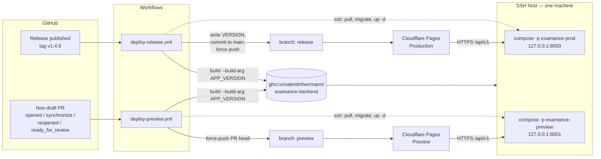
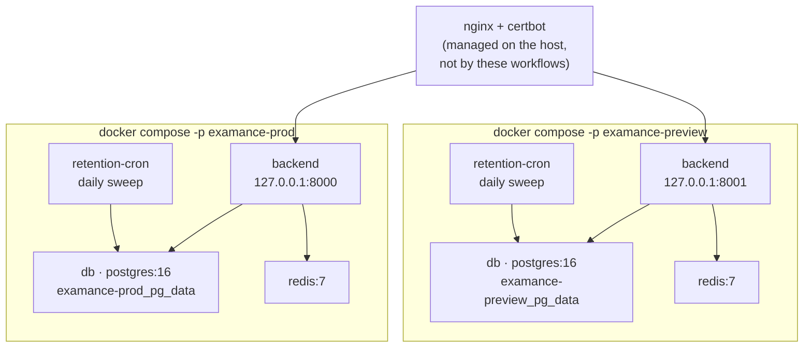
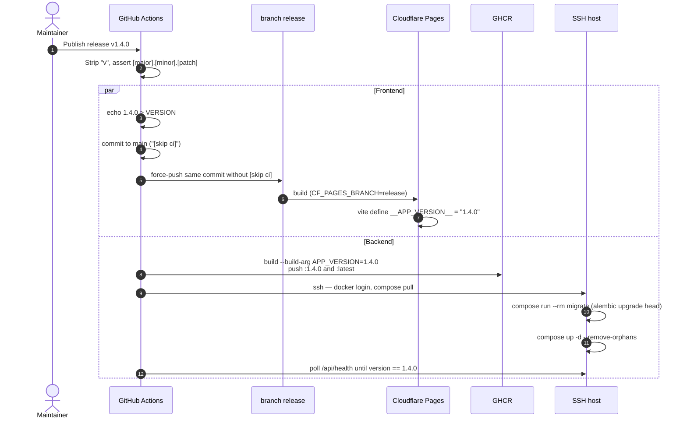
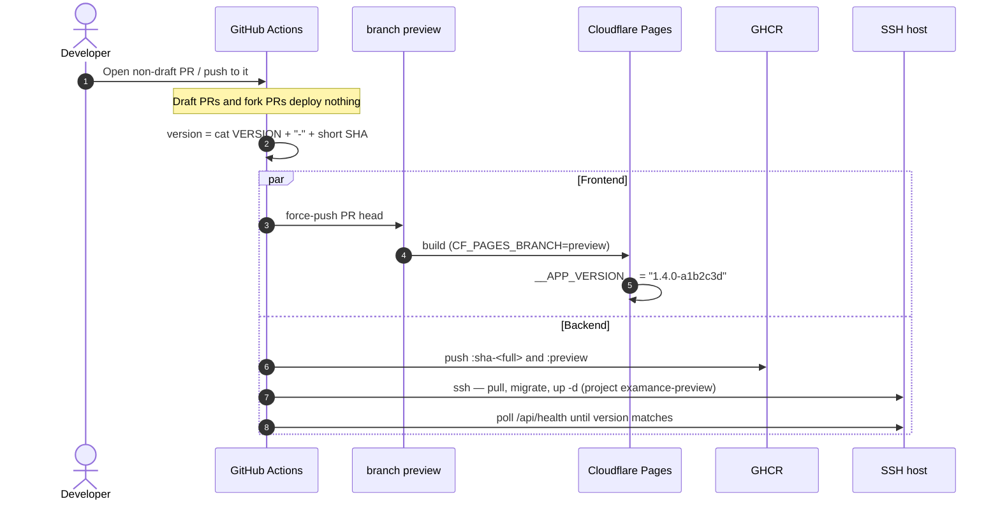
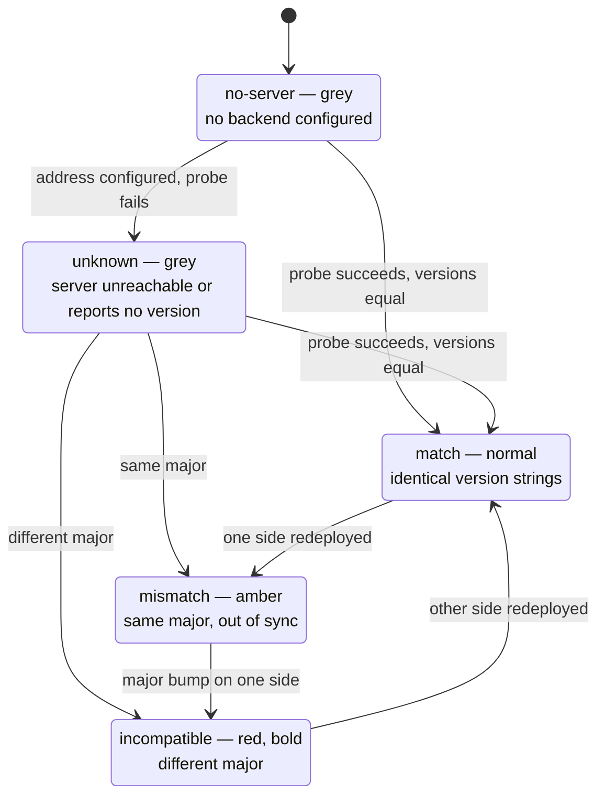

# Deployment

Examance ships as two artefacts that always carry **the same version number, deployed at the same time**:

- **Frontend** — static SvelteKit build on Cloudflare Pages.
- **Backend** — Docker image on GHCR, run as a `docker compose` stack on an SSH-reachable server.

There are two fully independent instances, **production** and **preview**.

| | Production | Preview |
|---|---|---|
| Trigger | GitHub Release published | Non-draft PR opened / pushed to |
| Version | `1.4.0` (from the release tag) | `1.4.0-a1b2c3d` (latest release + short commit SHA) |
| Frontend branch | `release` | `preview` |
| Pages environment | Production | Preview |
| Image tag | `ghcr.io/…/examance-backend:1.4.0` + `:latest` | `…:sha-<full-sha>` + `:preview` |
| Compose project | `examance-prod` | `examance-preview` |
| Loopback port | `8000` | `8001` |
| Volumes | `examance-prod_pg_data` | `examance-preview_pg_data` |
| Server env file | `$DEPLOY_APP_DIR/prod/.env` | `$DEPLOY_APP_DIR/preview/.env` |

Publishing a GitHub Release is the **only** action needed to ship production. Nothing else is manual.

---

## 1. Topology



Each environment is a complete, isolated stack. The compose **project name** namespaces both container names and named volumes, so the two databases can never collide and **no preview process can reach production data**.



Postgres and Redis publish **no ports at all**; only the API is bound, and only to loopback. TLS terminates at the host's nginx.

---

## 2. Release flow (production)



The `[skip ci]`-then-amend step matters: the commit landing on `main` carries `[skip ci]` so it does not re-trigger CI, but the copy force-pushed to `release` must **not** carry it, or Cloudflare Pages skips the production build.

Both halves consume the same resolved version, which is what guarantees frontend and backend always ship the same number together.

## 3. Preview flow



There is exactly **one** preview instance, shared by all open PRs — the newest non-draft push wins. `concurrency: cancel-in-progress: true` collapses rapid pushes; production uses `cancel-in-progress: false` so a release deploy is never interrupted.

---

## 4. Versioning

`/VERSION` at the repository root is the single source of truth. It holds a bare semver (`1.4.0`, no `v`) and is written by the release workflow from the release tag. `frontend/package.json` and `backend/pyproject.toml` versions are **not** part of this chain.

```
Production build   1.4.0                 VERSION verbatim
Preview build      1.4.0-a1b2c3d         VERSION + "-" + 7-char commit SHA
Local dev          0.0.0-dev
```

How it reaches each artefact:

- **Frontend** — `frontend/vite.config.ts` reads `../VERSION` at config-eval time and inlines the result via Vite `define` as `__APP_VERSION__`. It picks the preview form whenever `CF_PAGES_BRANCH` is set to anything other than `release`. Because `define` substitutes a literal into an already-bundled same-origin chunk, no new inline script appears and the CSP hashing in `frontend/scripts/generate-csp-headers.mjs` is unaffected.
- **Backend** — `docker build --build-arg APP_VERSION=…` → `ENV APP_VERSION` in `backend/Dockerfile` → `Settings.APP_VERSION` in `backend/app/config.py` → reported by `GET /api/health` and used as the FastAPI `version`.

`GET /api/health` now returns:

```json
{ "status": "ok", "version": "1.4.0" }
```

This endpoint is unauthenticated by design — the frontend probes it before any login. Exposing the build version is deliberate, low-risk information disclosure: it is the mechanism by which incompatibility is detected, and it is the same class of data a `Server` header leaks. It touches neither authentication, encryption, nor retention.

### Compatibility indicator

**A difference in major version means the frontend and backend are incompatible.** The status bar shows the version and colours it accordingly:



The label reads `v1.4.0` when in sync and `v1.4.0 / 1.3.2` when the two differ, so both numbers are visible at a glance. Comparison lives in `frontend/src/lib/stores/versionStore.ts` (`compareVersions`); the probe re-runs when the backend address changes and when the session unlocks.

---

## 5. Secrets and variables

SSH credentials are declared **once**, at repository level, and shared by both environments:

| Repository secret | Purpose |
|---|---|
| `DEPLOY_HOST` | SSH hostname or IP |
| `DEPLOY_USER` | SSH username |
| `DEPLOY_SSH_KEY` | PEM private key matching the server's `authorized_keys` |
| `DEPLOY_PORT` | SSH port (optional, defaults to `22`) |

Neither pushing to GHCR from CI nor the server's pull needs a stored registry credential — both use the workflow's own `GITHUB_TOKEN`. Each job mints its own copy, valid only for that job's duration, so the `backend-deploy` job's token is still live during its SSH step and can be handed to the server's `docker login` for that one pull. It requires `permissions: packages: read` on that job (already set in both workflows) but no secret you have to create or rotate.

Everything that differs per environment is a GitHub **Environment variable** (Settings → Environments → `production` / `preview` → Variables), not a secret:

| Environment variable | Production | Preview |
|---|---|---|
| `DEPLOY_APP_DIR` | `/home/deploy/examance` | `/home/deploy/examance` |
| `BACKEND_PUBLIC_URL` | `https://api.examance.…` | `https://api-preview.examance.…` |

Per-environment `SECRET_KEY` and `POSTGRES_PASSWORD` live **only** in the server's `.env` files and never pass through CI. Production and preview must use **different** values for both — sharing a `SECRET_KEY` would let a preview build mint tokens production accepts.

### Cloudflare Pages (dashboard-managed)

- Production branch: `release`.
- Preview branches: **only** `preview` (Settings → Builds → "Include only certain branches"). This keeps every feature branch from consuming build minutes and gives preview a stable URL, `prev-examance.valentin-herrmann.com`, already covered by `CORS_ALLOWED_ORIGIN_REGEX`.
- Root directory `frontend/`, build command `npm run build`, output `frontend/build/` — unchanged.
- **Custom domains are mandatory for both environments** (Settings → Custom domains): `examance.valentin-herrmann.com` for `release`, `preview.examance.valentin-herrmann.com` for `preview`. `FRONTEND_URL` must point at these, never at the `*.pages.dev` URL: that domain sits on URL blocklists, so outbound mail relays reject password-reset mails linking to it with `550 5.7.1 Refused by local policy … (B-URL)`. Serving reset links from the same registrable domain as `SMTP_FROM_EMAIL` also avoids the From/link mismatch that phishing filters score. `validate_frontend_url_for_email` (`backend/app/config.py`) refuses to start on a blocklisted `FRONTEND_URL` whenever `SMTP_HOST` is set outside development.
- Environment variable `PUBLIC_DEFAULT_BACKEND_URL`, set per Cloudflare environment to that environment's API origin. It seeds the backend address on a fresh browser profile so the production frontend defaults to the production API and the preview frontend to the preview API. It is only a default: a saved address always wins and the user can still point the app anywhere.

---

## 6. First-time server setup

```bash
# 1. Directories, one per environment
mkdir -p ~/examance/prod ~/examance/preview

# 2. Env files from the templates in deploy/ — 0600, never committed
install -m 600 /dev/null ~/examance/prod/.env
install -m 600 /dev/null ~/examance/preview/.env
# paste deploy/env.prod.example / deploy/env.preview.example and fill in:
openssl rand -hex 32   # SECRET_KEY        — different per environment
openssl rand -hex 24   # POSTGRES_PASSWORD — different per environment

# 3. First boot (CI does this on every deploy afterwards)
cd ~/examance/prod
docker compose -p examance-prod -f docker-compose.deploy.yml --env-file .env pull
docker compose -p examance-prod -f docker-compose.deploy.yml --env-file .env --profile tools run --rm migrate
docker compose -p examance-prod -f docker-compose.deploy.yml --env-file .env up -d

# 4. Find the bridge gateway and put it in .env as PROXY_ALLOWED_IPS
docker network inspect examance-prod_default -f '{{(index .IPAM.Config 0).Gateway}}'
```

Then an nginx server block per environment proxying to `127.0.0.1:8000` / `127.0.0.1:8001`, with `certbot --nginx` for TLS. nginx and certbot are managed on the host and are deliberately **not** touched by these workflows.

`PROXY_ALLOWED_IPS` must name the actual proxy address — never `*`. With a wildcard, any client could spoof `X-Forwarded-For` to reset its own rate-limit bucket and poison the audit log's IP hashes.

---

## 7. Runbook

**Manual redeploy** — Actions → *Deploy Release* → Run workflow → enter the version (e.g. `1.4.0`). Preview: Actions → *Deploy Preview* → Run workflow.

**Rollback**

```bash
cd ~/examance/prod
sed -i 's|^BACKEND_IMAGE=.*|BACKEND_IMAGE=ghcr.io/valentinherrmann/examance-backend:1.3.2|' .env
docker compose -p examance-prod -f docker-compose.deploy.yml --env-file .env up -d
```

Two things to know before rolling back:

- **Migrations run forward only.** `alembic upgrade head` runs on every deploy; reverting to an older image does **not** undo it. A schema change that an older backend cannot read has to be reverted deliberately with `alembic downgrade`, by hand, after taking a database dump. Automatic downgrade is deliberately never wired into CI.
- Rolling the backend back **across a major version** leaves the frontend on the newer major, so the status bar goes red until the frontend is rolled back too (re-point the `release` branch at the older commit).

**Logs**

```bash
docker compose -p examance-prod -f docker-compose.deploy.yml --env-file .env logs --tail 200 backend
```

**Check what is actually deployed**

```bash
curl -s https://api.examance.valentin-herrmann.com/api/health
# {"status":"ok","version":"1.4.0"}
```

**Reset the preview database** (safe — preview holds no production data):

```bash
cd ~/examance/preview
docker compose -p examance-preview -f docker-compose.deploy.yml --env-file .env down -v
```

**Verify the two stacks are really isolated**

```bash
docker volume ls | grep examance   # expect examance-prod_pg_data and examance-preview_pg_data
```
