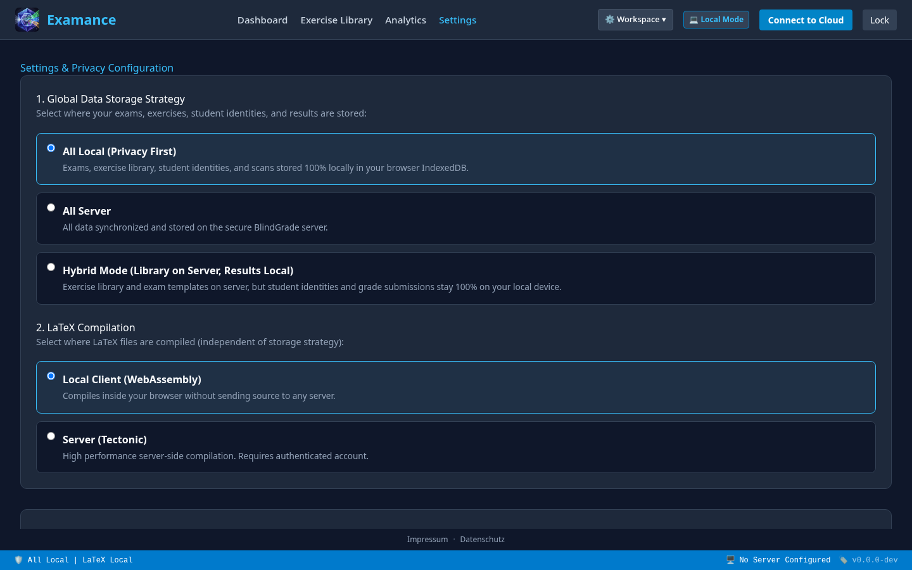

Examance / Schulische Verantwortung

# Innovation, die sich prüfen lässt.

Ein Bewertungsworkflow für Schulen, die Entlastung, Fairness und Datenschutz gemeinsam betrachten müssen.

CONCEPT / GOVERNANCE VISUALS ARE NOT DEPLOYMENT EVIDENCE

---

01 / Die Entscheidung

# Digital ist keine Compliance-Strategie.

Eine Einführung braucht mehr als eine Funktionsliste: Verantwortlichkeiten, Datenflüsse, Löschung, Konten, Hosting und die Grenzen des Produkts müssen sichtbar sein.

<b>Produktkontrolle</b>Verschlüsselung, Rollen, Speicheroptionen, Auditspuren.

<b>Schulentscheidung</b>Rechtsgrundlage, Aufbewahrung, Geräte, DPA, DPO-Prüfung.

<b>Pilotnachweis</b>Ein echter Ablauf mit messbaren und prüfbaren Kriterien.

---

02 / Betriebsmodell

# Wer sieht was? Und wer entscheidet?

<b>Lehrkraft</b>Erstellt Exams, scannt, korrigiert und wertet aus.

<b>Admin</b>Verwaltet Konten, Rollen und serverseitige Fähigkeiten.

<b>Examance</b>Stellt Produkt, Backend und dokumentierte Kontrollen bereit.

<b>Schule</b>Legt Zweck, Richtlinie, Fristen und Verantwortliche fest.

Die Rollen im Produkt ersetzen keine institutionelle Verantwortungszuweisung.

---

03 / Datenfluss

<h2>Verschlüsselung ist eine Grenze, keine Abkürzung.</h2>
Sensible Payloads werden im Browser verschlüsselt. Exams und Übungen bleiben serververwaltet. Der Kontomodus entscheidet, wo Ergebnisse liegen.

<strong>Scope präzise halten</strong> Pseudonymisierung während der Korrektur ist nicht dasselbe wie Anonymität. Server-Metadaten und institutionelle Pflichten bleiben relevant.

<figure><figcaption>CONCEPT / NOT A SCREENSHOT Konzeptvisualisierung; keine Darstellung eines konkreten Deployments.</figcaption></figure>

---

04 / Speicheroptionen

# Zwei Speicherformen. Eine Kontoverantwortung.

<table>
<tr><th></th><th>Hybrid</th><th>All-server</th></tr>
<tr><td><strong>Ergebnisse</strong></td><td>In diesem Browser, verschlüsselt</td><td>Auf dem Server, verschlüsselt</td></tr>
<tr><td><strong>Exams / Übungen</strong></td><td colspan="2">Serververwaltet</td></tr>
<tr><td><strong>Schlüssel</strong></td><td colspan="2">Bleibt clientseitig</td></tr>
<tr><td><strong>Entscheidung</strong></td><td colspan="2">Kontomodus und freigeschaltete Fähigkeiten</td></tr>
</table>

Der passende Modus ist eine Governance- und Betriebsentscheidung, nicht nur eine Präferenz im UI.

---

05 / Rollen und Fähigkeiten

# Admins verwalten den Rahmen.

<figure><figcaption>ALTE UI / LEGACY CAPTURE Privacy settings: aktueller Capture und Admin-Ansicht fehlen noch.</figcaption></figure>

<b>Server results</b>Ob All-server verfügbar ist.

<b>Server LaTeX</b>Welche Compile-Wege erlaubt sind.

<b>Exercise sharing</b>Ob gemeinsames Teilen freigeschaltet ist.

Fähigkeiten müssen aus dem Account-Kontext kommen, nicht aus einer hard-codierten Marketingliste.

---

06 / Vor dem Rollout

# Die offenen Punkte gehören auf den Tisch.

<b>Recht</b>Rechtsgrundlage, DPA, DPIA, Art. 30, DPO-Prüfung.

<b>Betrieb</b>Hosting, Subprozessoren, Backups, Löschfristen, private Geräte.

<b>Produkt</b>Scanfehler, Wiederherstellung, Rollen, Support und Export.

<strong>Wichtig:</strong> Die vorhandenen Rechtsdokumente sind Arbeitsvorlagen und keine Rechtszertifizierung.

---

07 / Pilotentscheidung

# Erst ein kontrollierter Ablauf. Dann Skalierung.

Ein Pilot mit einer Abteilung oder einer Klasse macht Nutzen, Risiken und Verantwortlichkeiten sichtbar, bevor die Schule breiter ausrollt.

<b>Erfolgskriterien</b>Weniger manuelle Arbeit, bessere Rückmeldung, nachvollziehbare Datenflüsse, klarer Eskalationsweg.

<h3>Für die Entscheidung</h3>
Eine reale Prüfungssequenz, synthetische oder freigegebene Daten, dokumentierte Schulrichtlinie und ein Review mit den Verantwortlichen.
CONCEPT / PILOT FRAMEWORK

