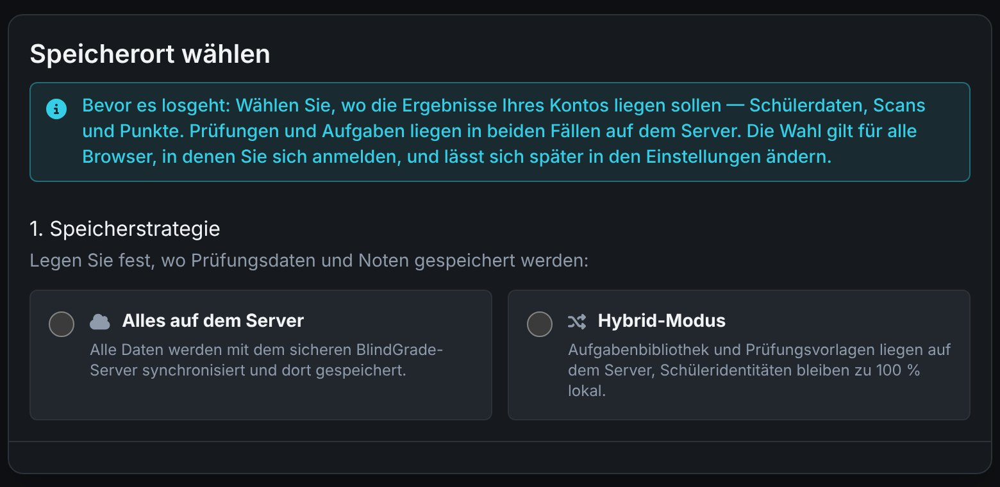
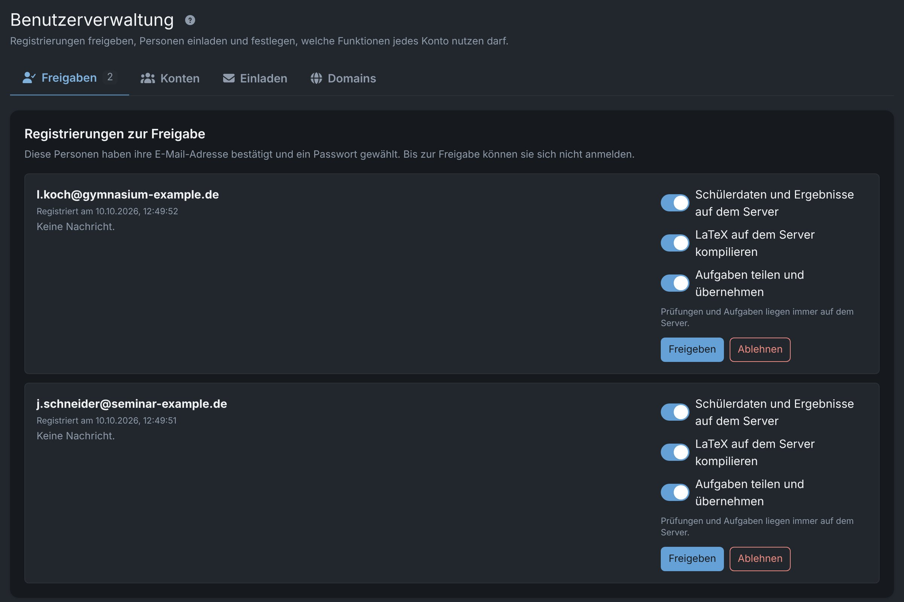
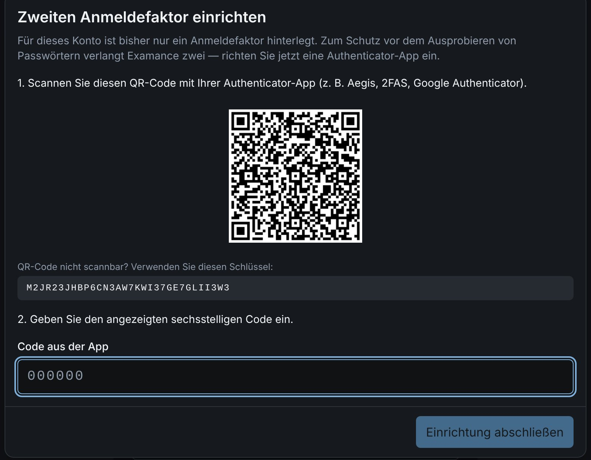

<!-- _class: title -->
<!-- _paginate: false -->

Für Schulleitung, Datenschutz und IT

# Was Examance mit Prüfungsdaten macht – und was nicht.

Ein Überblick über Datenflüsse, Verschlüsselung, Rollen und die Punkte, die eine Schule vor dem Einsatz selbst entscheiden muss.

<figure class="shot"><figcaption>Benutzerverwaltung: Funktionen je Konto ein- und ausschalten</figcaption></figure>

---

Worum es geht

# Ein Werkzeug für schriftliche Prüfungen auf Papier

Lehrkräfte stellen Klausuren aus einer Aufgabenbibliothek zusammen, lassen sie wie gewohnt schreiben, scannen den Stapel und korrigieren am Bildschirm – ohne dabei die Namen zu sehen.

<b>Aufgaben</b>Bibliothek je Lehrkraft, optional in der Fachschaft geteilt.

<b>Klausur</b>Druckfertiges PDF mit Notenschlüssel und Lösung.

<b>Papier</b>Schülerinnen und Schüler schreiben wie bisher.

<b>Scan</b>QR-Code mit Pseudonym ordnet die Bögen zu.

<b>Korrektur</b>Anonym, danach Noten und Auswertung.

<h3>Web-Anwendung</h3>
Keine Installation auf Schulrechnern; jede Lehrkraft hat ein eigenes Serverkonto.

<h3>Offener Quellcode</h3>
MIT-Lizenz. Die Schule kann den Code prüfen lassen und selbst betreiben.

<h3>Beta</h3>
Version 0.2. Für einen begrenzten, begleiteten Einsatz gedacht, nicht für den flächigen Betrieb.

---

Datenfluss

# Verschlüsselt wird im Browser – vor dem Speichern

<h3>Browser der Lehrkraft</h3>Der Schlüssel entsteht hier aus der Anmeldung und verlässt das Gerät nicht. Scans werden hier gelesen und verschlüsselt.

→

<h3>Übertragung</h3>Nur Chiffrat für Schülerdaten, über TLS.

→

<h3>Server</h3>Speichert Chiffrat, Kontodaten und die Aufgabenbibliothek. Kann Schülerdaten nicht entschlüsseln.

<table style="margin-top:20px">
<tr><th>Daten</th><th>Wo</th><th>Für den Server lesbar?</th></tr>
<tr><td>Namen, Schülernummern, Scans, Anmerkungen, Einzelpunkte</td><td>Browser; im Server-Modus zusätzlich auf dem Server</td><td class="y">Nein – AES-256-GCM, Schlüssel nur im Browser</td></tr>
<tr><td>Gesamtpunktzahl je Abgabe (pseudonym)</td><td>Server</td><td class="n">Ja, ohne Namen</td></tr>
<tr><td>Klausurdaten: Titel, Klasse, Fach, Datum, Nachname der Lehrkraft</td><td>Server</td><td class="n">Ja</td></tr>
<tr><td>Aufgaben- und Klausurtexte (LaTeX)</td><td>Server</td><td class="n">Ja</td></tr>
<tr><td>Konto: E-Mail, Rolle, Passwort-Hash, Freischaltungen</td><td>Server</td><td class="n">Ja (Passwort nur als Argon2id-Hash)</td></tr>
</table>

---

Speicherort

## Zwei Modi, pro Konto festgelegt

<table>
<tr><th></th><th>Hybrid</th><th>Server</th></tr>
<tr><td>Aufgaben, Klausuren</td><td>Server</td><td>Server</td></tr>
<tr><td>Schülerdaten, Scans, Punkte</td><td>nur im Browser</td><td>Server, verschlüsselt</td></tr>
<tr><td>Mehrere Geräte</td><td>nein</td><td>ja</td></tr>
<tr><td>Sicherung</td><td>verschl. Archiv</td><td>serverseitig</td></tr>
</table>

<strong>Hinweis Hybrid:</strong> Die Daten liegen dann auf dem Gerät der Lehrkraft. Landesrecht kann die Verarbeitung auf privaten Endgeräten einschränken (in Bayern z. B. ausdrücklich geregelt).

<figure class="shot"><figcaption>Bei der ersten Anmeldung muss der Modus gewählt werden</figcaption></figure>

Die Administration legt pro Konto fest, ob der Server-Modus erlaubt ist. Wird er entzogen, verschiebt die App die Ergebnisse beim nächsten Öffnen in den Browser; ein Wechsel wird geprüft, bevor die alte Kopie gelöscht wird.

---

Rollen

# Was die Administration kann – und was nicht

<h3>Kann</h3>
<ul class="small">
<li>Registrierungen freigeben oder ablehnen, Personen einladen</li>
<li>Domains festlegen, deren Adressen automatisch freigeschaltet werden</li>
<li>Pro Konto: Ergebnisse auf dem Server, LaTeX auf dem Server, Aufgaben teilen</li>
<li>Konten löschen; Rollen werden auf dem Server per Kommandozeile geändert</li>
</ul>

<h3>Kann nicht</h3>
<ul class="small">
<li>Klausuren, Aufgaben oder Ergebnisse von Lehrkräften öffnen – Admin-Konten haben gar keinen Zugriff auf Unterrichtsdaten</li>
<li>Verschlüsselte Schülerdaten lesen, auch nicht direkt in der Datenbank</li>
<li>Nach einem Passwort-Reset die Daten einer Lehrkraft wiederherstellen; dafür gibt es nur ihren persönlichen Wiederherstellungscode</li>
</ul>

Das ist Absicht: Wer den Server betreibt, soll Prüfungsdaten nicht einsehen können – auch nicht bei einem Einbruch in den Server.

---

Konten

## Wer ein Konto bekommt, entscheidet die Schule

<ul class="small">
<li><strong>Einladung</strong> durch die Administration, oder</li>
<li><strong>Registrierung</strong>: E-Mail bestätigen, Passwort wählen, dann Freigabe durch die Administration.</li>
<li>Adressen von hinterlegten Schul-Domains werden nach der E-Mail-Bestätigung automatisch freigeschaltet.</li>
<li>Unbestätigte und nicht freigegebene Anträge werden nach einer Frist automatisch gelöscht.</li>
</ul>

<figure class="shot"><figcaption>Freigaben: zwei Registrierungen warten, Funktionen vorab wählbar</figcaption></figure>

---

Anmeldung

## Ein Passwort allein reicht nicht

<ul class="small">
<li>Zwei von drei Faktoren: Passwort, Authenticator-App, Passkey. Ein Passkey mit Geräte-PIN oder Biometrie genügt allein.</li>
<li>Ohne zweiten Faktor erreicht ein Konto nichts außer der Einrichtung.</li>
<li>Sperre nach Fehlversuchen pro Konto, zeitlich begrenzt.</li>
<li>Sitzungen laufen nach Inaktivität ab; ein gesperrter Tab enthält keine lesbaren Daten.</li>
<li>Protokoll sicherheitsrelevanter Aktionen, IP-Adressen nur als Hash.</li>
</ul>

<figure class="shot"><figcaption>Erste Anmeldung: der zweite Faktor ist Pflicht</figcaption></figure>

---

Betrieb

# Drei Betriebsmodelle, drei Verantwortungslagen

<table style="margin-top:8px">
<tr><th>Modell</th><th>Verantwortlich für Schülerdaten</th><th>Was es braucht</th></tr>
<tr><td><strong>A · Schule betreibt selbst</strong> Backend als Docker-Container, Frontend statisch</td><td>Die Schule</td><td>Kein Auftragsverarbeitungsvertrag; Verzeichnis, DSFA und Information der Betroffenen durch die Schule</td></tr>
<tr><td><strong>B · Dienstleister betreibt für Schulen</strong></td><td>Die Schule</td><td>Vertrag zur Auftragsverarbeitung (Vorlage liegt bei), Unterauftragnehmer offenlegen</td></tr>
<tr><td><strong>C · Private Instanz für Lehrkräfte</strong> so läuft die aktuelle Beta-Instanz</td><td>Lehrkraft bzw. ihre Schule</td><td>Klärung mit der Schule, bevor echte Schülerdaten verarbeitet werden</td></tr>
</table>

Wird das Frontend über einen CDN-Anbieter mit Sitz in den USA ausgeliefert, ist das eine Drittlandübermittlung von Zugriffsdaten. Beim Selbstbetrieb in der EU entfällt sie.

---

Unterlagen

# Was bereits dokumentiert ist

<h3>Datenfluss & Sicherheit</h3>
Schlüsselableitung, Verschlüsselung, Sitzungen, Anmeldefaktoren, bekannte Kompromisse.

<h3>DSGVO-Prüfung</h3>
Technische Bewertung gegen DSGVO, BDSG und bayerisches Schulrecht, mit Befunden und Stand.

<h3>DSFA-Vorlage</h3>
Datenschutz-Folgenabschätzung nach Art. 35, vorbereitet zum Ausfüllen.

<h3>Verzeichnis (Art. 30)</h3>
Vorlage für das Verzeichnis von Verarbeitungstätigkeiten.

<h3>AV-Vertrag</h3>
Vorlage für die Auftragsverarbeitung (Modell B).

<h3>Vorfallsplan</h3>
Checkliste für den Fall einer Datenpanne, mit Meldewegen.

Diese Unterlagen sind <strong>Arbeitsvorlagen aus der Entwicklung</strong>. Sie ersetzen weder die Prüfung durch die oder den Datenschutzbeauftragten noch eine Rechtsberatung.

---

<!-- _class: center -->

Vor einem Einsatz

# Was die Schule entscheiden muss

<ul class="small">
<li>Rechtsgrundlage bestätigen (in Bayern Art. 85 BayEUG mit BaySchO)</li>
<li>Aufbewahrungsfrist für Prüfungsarbeiten festlegen</li>
<li>Betriebsmodell wählen, ggf. AV-Vertrag schließen</li>
<li>DSFA abschließen und das Verzeichnis ergänzen</li>
</ul>

<ul class="small">
<li>Regel für private Endgeräte, besonders für den Hybrid-Modus</li>
<li>Welche Funktionen freigeschaltet werden (Server-Ergebnisse, Teilen)</li>
<li>Ansprechperson und Supportweg für Lehrkräfte</li>
<li>Information der Schülerinnen, Schüler und Eltern</li>
</ul>

Für Auskunft und Löschung nach Art. 15 und 17 DSGVO gibt es in der App eine eigene Ansicht je Schülerin und Schüler. Ein täglicher Aufbewahrungslauf löscht abgelaufene Daten auf dem Server; die Fristen sind konfigurierbar und stehen in der Datenschutzerklärung der Instanz.

---

<!-- _class: center -->

Vorschlag

# Erst ein begrenzter Pilot

<b>Rahmen</b>Eine Fachschaft, ein Halbjahr, wenige freiwillige Lehrkräfte.

<b>Probelauf</b>Zuerst mit erfundenen Daten, dann eine echte Kurzarbeit.

<b>Begleitung</b>Datenschutzprüfung parallel; Rückfragen an einen festen Kontakt.

<b>Bilanz</b>Zeitaufwand, Fehler bei Scan und Erkennung, Akzeptanz, offene Rechtsfragen.

<h3>Ausstieg jederzeit</h3>
Ergebnisse lassen sich als Tabelle und als verschlüsseltes Archiv exportieren; Lehrkräfte können ihr Konto selbst löschen.

<h3>Ansehen statt glauben</h3>
Der komplette Ablauf lässt sich mit einer Probeklausur und erfundenen Daten vorführen, einschließlich Benutzerverwaltung.

