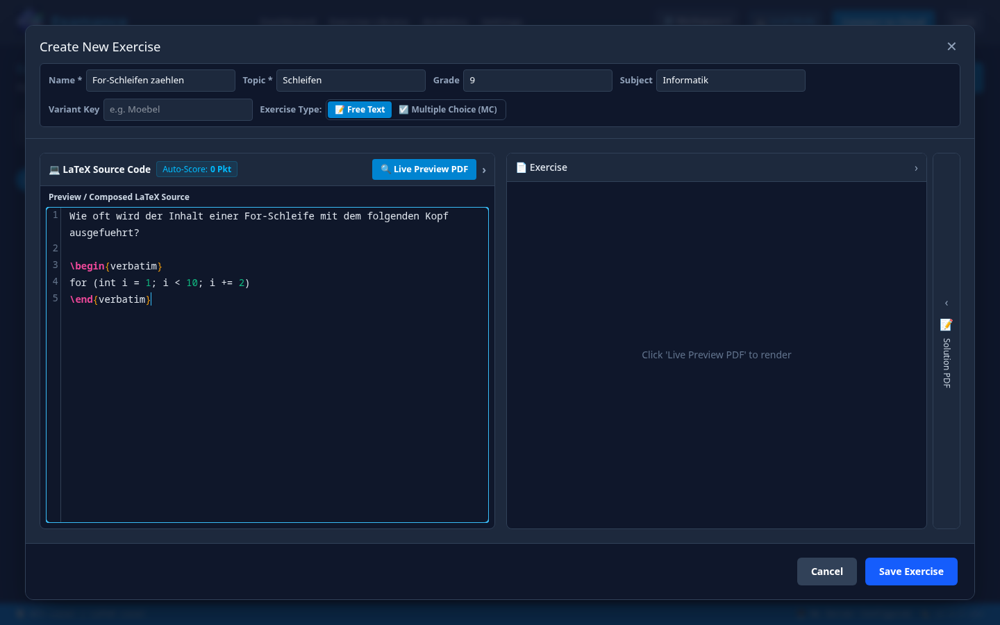

<!-- _class: lead -->

Examance / Fachbereich Informatik

# Vom Arbeitsblatt zu belastbaren Daten.

Ein Bewertungsworkflow für Lehrkräfte, die LaTeX, Varianten, QR-Codes und faire Korrektur nicht in fünf Insellösungen zusammensetzen wollen.

VISUELLES KONZEPT / AKTUELLER UI-CAPTURE FOLGT

---

01 / Der Engpass

# Gute Aufgaben. Schlechter Nachlauf.

Die eigentliche Informatik steckt in der Aufgabe. Die Zeit verschwindet danach: Varianten pflegen, Punkte übertragen, Scans sortieren, Unsicherheiten prüfen.

<b>Varianten</b>A/B/C-Versionen bleiben vergleichbar.

<b>Korrektur</b>Identität bleibt beim Markieren aus dem Blick.

<b>Auswertung</b>Fragen werden zur Rückmeldung für den Unterricht.

---

02 / Die Pipeline

# Ein durchgehender technischer Ablauf.

<b>01</b>Übung in LaTeX schreiben und taggen

<b>02</b>Varianten wählen, QR-Heft erzeugen

<b>03</b>Stapel scannen, QR-Codes auflösen

<b>04</b>Antworten pseudonym korrigieren

<b>05</b>Ergebnisse fachlich auswerten

Ein Workflow. Unterschiedliche Speicherorte für Ergebnisse: hybrid oder all-server.

---

03 / Authoring

<h2>LaTeX ist kein Sonderfall.</h2>

Übungen bleiben als strukturierte Bausteine wiederverwendbar. Fach, Jahrgang, Thema, Punkte, Version und Variante sind Teil des Arbeitsprozesses.

<strong>Was getestet werden soll</strong> Vorlagen, Ressourcen, Punktelogik, Variantenwechsel und der Umgang mit bestehenden Arbeitsblättern.

<figure>

<figcaption>ALTE UI / LEGACY CAPTURE Editoransicht: visueller Beleg, vor externer Nutzung aktualisieren.</figcaption>
</figure>

---

04 / Varianten

# Gleiche Kompetenz. Andere Oberfläche.

<figure>

<figcaption>ALTE UI / LEGACY CAPTURE Bibliotheksansicht: aktueller Capture wird nachgeliefert.</figcaption>
</figure>

<b>Versionen</b>Änderungen bleiben nachvollziehbar.

<b>Varianten</b>Unterschiedliche Formulierungen bleiben einer Aufgabe zugeordnet.

<b>Tags</b>Die nächste Klausur beginnt nicht bei null.

---

05 / QR + Druck

# Papier bleibt Papier. Der Kontext wird maschinenlesbar.

QR

Examance erzeugt ein druckfertiges Heft mit eindeutigen Codes. So kann der Scan später wieder an Exam, Variante und Platz zugeordnet werden.

<figure>

<figcaption>ALTE UI / LEGACY CAPTURE Exam-Aufbau: aktuelle QR-Vorschau separat erfassen.</figcaption>
</figure>

---

06 / Scan

# Der Stapel wird ein Datensatz.

<figure><figcaption>CONCEPT / NOT A SCREENSHOT Scan-Import und QR-Splitting als Konzeptdarstellung.</figcaption></figure>

<h3>Zu prüfen</h3>
Scannerauflösung, schiefe Seiten, fehlende QR-Codes, gemischte Varianten, große Stapel und Offline-Verhalten.

<strong>Kein Produkt-Capture:</strong> Diese Darstellung wird durch einen echten Scan-Import mit synthetischen Daten ersetzt.

---

07 / Korrektur

# Erst die Antwort. Dann die Zuordnung.

Während der Korrektur sieht die Lehrkraft die Antwort und den Bewertungsmaßstab, nicht den Namen.

Das ist pseudonyme, identity-hidden Korrektur für diesen Arbeitsschritt — keine Behauptung, dass der gesamte Prozess anonym ist.

<figure><figcaption>CONCEPT / NOT A SCREENSHOT Grading-Ansicht, ersetzt durch einen echten Capture.</figcaption></figure>

---

08 / OMR

# Automatik mit menschlicher Kontrolle.

<figure><figcaption>CONCEPT / NOT A SCREENSHOT Unsichere Markierungen werden bestätigt, nicht blind übernommen.</figcaption></figure>

MC/SC-Aufgaben können automatisch gelesen werden. Die interessanten Testfälle liegen am Rand: schwache Markierungen, Korrekturen, mehrere Kreuze, schlechte Scans.

<strong>Feedbackschleife</strong> Welche Unsicherheit braucht Aufmerksamkeit? Welche Korrektur ist schnell genug?

---

09 / Ergebnisse

# Aus Korrekturen werden Fragen für den Unterricht.

<figure><figcaption>CONCEPT / NOT A SCREENSHOT Beispielansicht mit ausdrücklich markierten Demo-Daten.</figcaption></figure>

<b>Verteilung</b>Wo liegt die Klasse?

<b>Aufgabe</b>Welche Frage trennt Verständnis von Zufall?

<b>Variante</b>Bleiben Gruppen vergleichbar?

---

10 / Architektur

# Der Browser ist Teil des Vertrauensmodells.

<b>Browser</b>Schlüssel wird entsperrt; sensible Payloads werden clientseitig verschlüsselt.

<b>Server</b>Exams und Übungen liegen dort; Ergebnisse je nach Kontomodus.

<b>Hybrid</b>Ergebnisse bleiben in diesem Browser, verschlüsselt in IndexedDB.

<b>All-server</b>Ergebnisse liegen verschlüsselt auf dem Server.

Pseudonymisierung während der Korrektur ist nicht dasselbe wie Anonymität. Institutionelle Rechtsprüfung bleibt erforderlich.

---

11 / Pilotfragen

# Was wir von Informatiklehrkräften lernen wollen.

<h3>Hardware</h3>
Welche Scanner und Auflösungen stehen wirklich zur Verfügung?

<h3>Edge cases</h3>
Welche Markierungen, QR-Fehler und Layouts brechen den Ablauf?

<h3>Unterricht</h3>
Welche Auswertung hilft bei der nächsten Stunde wirklich?

Für einen realistischen Pilot werden ein echter Prüfungsablauf, synthetische oder freigegebene Beispieldaten und konkretes Feedback zu Korrektur, OMR und LaTeX benötigt.

