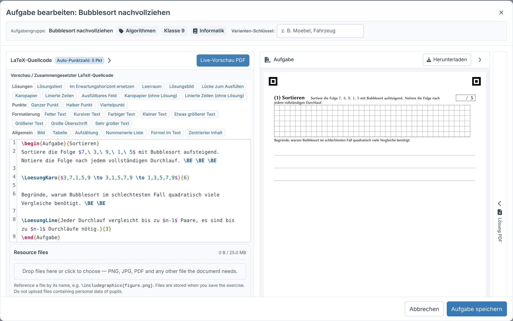
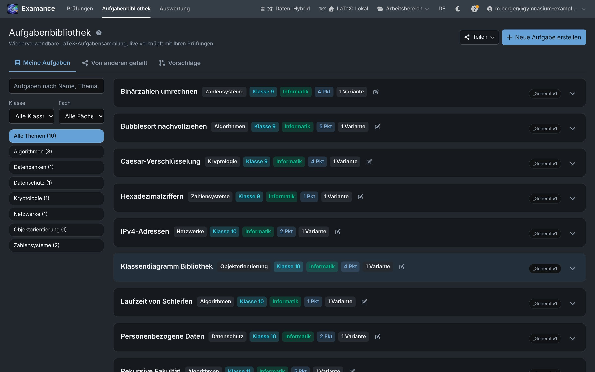
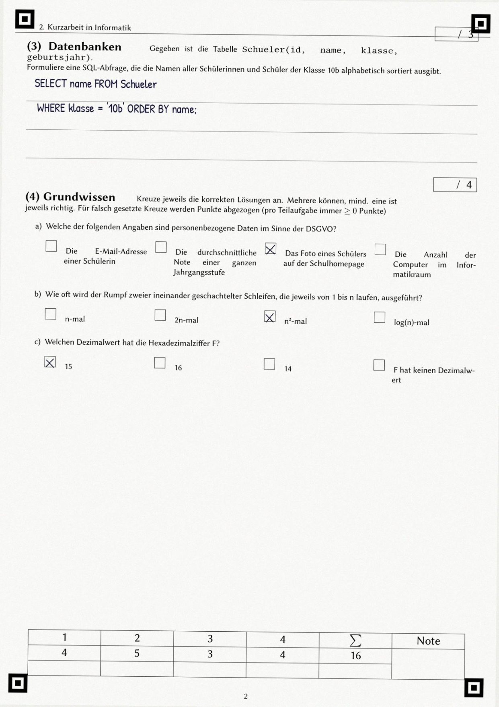
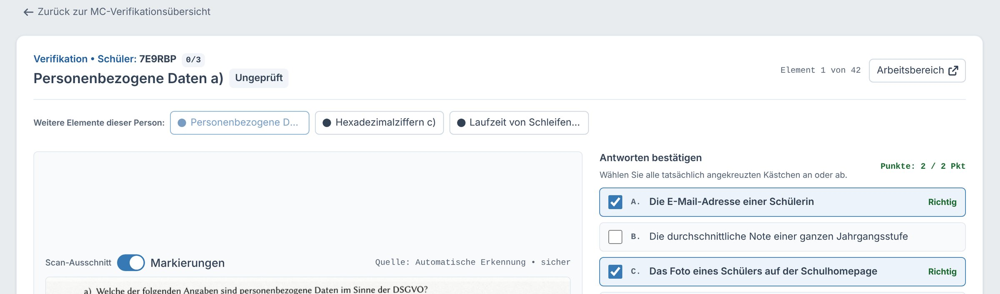
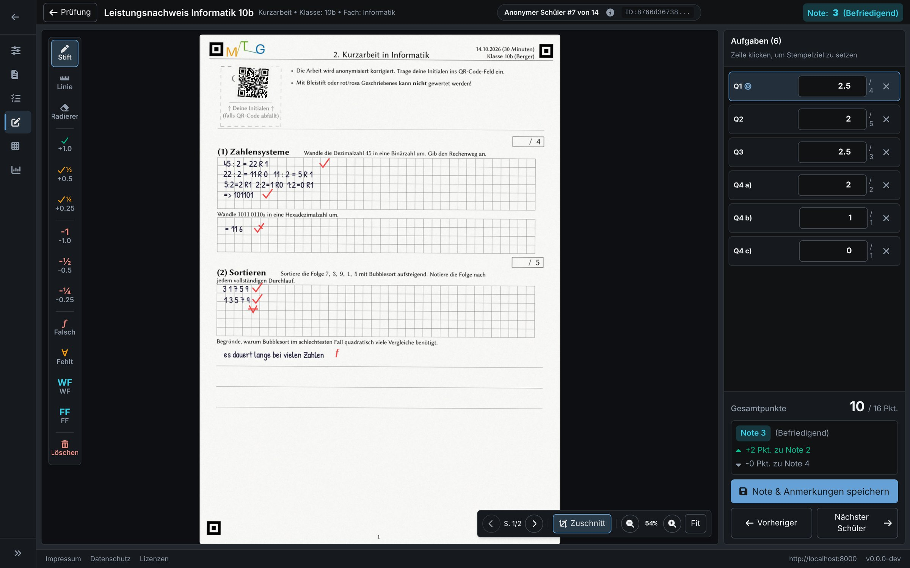
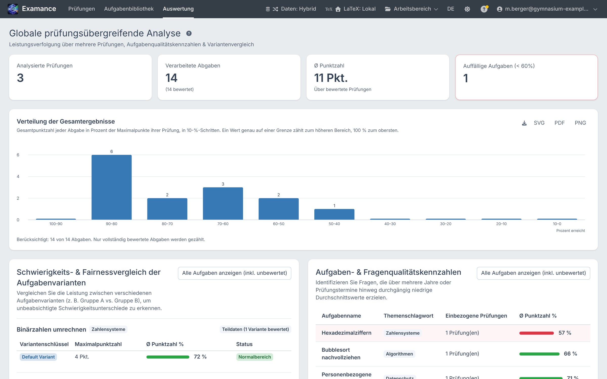
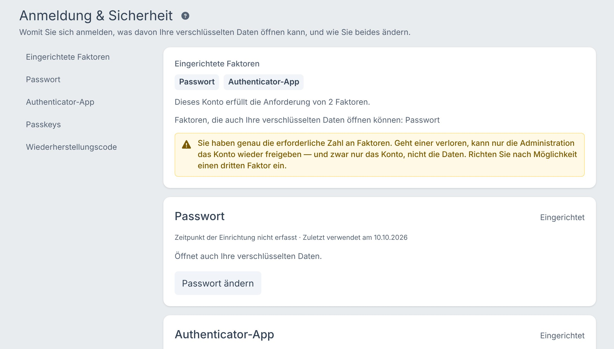

<!-- _class: title -->
<!-- _paginate: false -->

Beta-Test · Fachschaft Informatik

# Prüfungen in LaTeX schreiben, auf Papier schreiben lassen, im Browser korrigieren.

Wir suchen Informatik-Lehrkräfte, die Examance mit echten Abläufen testen und uns sagen, wo es hakt – technisch wie didaktisch.

<figure class="shot"><figcaption>Aufgabeneditor: LaTeX-Quelle links, gesetzte Aufgabe rechts</figcaption></figure>

---

Stand der Dinge

# Was Examance heute ist

<h3>Produkt</h3>
<dl class="facts">
<dt>Version</dt><dd>0.2.1, Beta</dd>
<dt>Lizenz</dt><dd>MIT, Quellcode vollständig einsehbar</dd>
<dt>Frontend</dt><dd>SvelteKit / Svelte 5, läuft komplett im Browser</dd>
<dt>Backend</dt><dd>FastAPI, PostgreSQL, Redis, Docker</dd>
<dt>LaTeX</dt><dd>XeLaTeX im Browser (WebAssembly) oder Tectonic auf dem Server</dd>
<dt>Sprachen</dt><dd>Deutsch und Englisch</dd>
</dl>

<h3>Durchgängig nutzbar</h3>
Bibliothek, Klausursatz, Scan-Import mit QR-Zuordnung, anonyme Korrektur, MC-Erkennung mit Prüfansicht, Auswertung, Export.

<h3>Wo wir Rückmeldung brauchen</h3>
Scanner- und Kopiererergebnisse, MC-Erkennung an Grenzfällen, eigene LaTeX-Vorlagen, Bedienung auf dem Tablet.

---

Die Pipeline

# Vom Quelltext zur Notenverteilung

<b>Aufgabe</b>LaTeX mit <code>Schulaufgabe.sty</code>; jedes <code>\BE</code> ist ein Punkt.

<b>Satz</b>XeLaTeX als WASM im Browser oder Tectonic im Container. Lösung aus derselben Quelle.

<b>Scan</b>pdf.js rendert, <code>zxing-wasm</code> liest QR-Codes, OMR läuft parallel in Web Workern.

<b>Korrektur</b>Annotationen als Ebene auf dem Scan; Punkte werden mit Auswahl und Erkennungsdaten versiegelt.

<b>Statistik</b>Notenschlüssel, Grenzfälle, Aufgabenqualität und Variantenvergleich.

<h3>Pseudonym im QR-Code</h3>
Der Code auf dem Bogen trägt Pseudonym, Variante und Ersatzcode – keinen Namen.

<h3>Passmarken</h3>
Vier Marken pro Seite; die Lage der Kästchen stammt aus einem leeren Satz der Klausur.

<h3>Alles clientseitig</h3>
Scans werden im Browser zerlegt, gelesen und verschlüsselt, bevor irgendetwas gespeichert wird.

---

Aufgaben schreiben

## LaTeX bleibt LaTeX

<ul class="small">
<li>Eine Quelle für Angabe und Lösung: <code>\LoesungKaro</code>, <code>\LoesungLine</code>, <code>\LoesungLuecke</code> zeigen im Schülerblatt Raster, Linien oder Lücken, im Lösungsblatt den Inhalt.</li>
<li>MC-Fragen über einen strukturierten Editor; Optionen und Schlüssel stehen im LaTeX selbst.</li>
<li>Ressourcen pro Aufgabe (<code>\includegraphics</code>, <code>\input</code>), TikZ, UML und Struktogramme sind eingebunden.</li>
<li>Varianten (A/B) und Versionen; alte Klausuren bleiben unverändert.</li>
<li>Bibliothek nach Thema, Jahrgang und Fach; optional mit der Fachschaft teilen und Änderungen vorschlagen.</li>
</ul>

<figure class="shot"><figcaption>Aufgabenbibliothek, dunkles Farbschema</figcaption></figure>

---

Scan und Erkennung

<figure class="shot"><figcaption>Synthetischer Scan, Seite 2</figcaption></figure>

## Multiple Choice: Messung plus menschliche Prüfung

<figure class="shot"><figcaption>Prüfansicht: Scan-Ausschnitt, erkannte Kreuze, Punkte nach aktuellem Schlüssel</figcaption></figure>

<ul class="small">
<li>Zwei Verfahren laufen immer mit: <strong>v4</strong> (Strichform, Standard) und <strong>v2</strong> (Füllgrad); die Prüfansicht zeigt, welches bei Ihren Daten öfter richtig lag.</li>
<li>Zurückgenommene, übermalte und sehr blasse Kreuze werden als unsicher vorgelegt. Zufällige Stichproben wirken dem Selektionsbias entgegen.</li>
<li>Optional: anonymisierte 80×48-Pixel-Ausschnitte einzelner Kästchen spenden, um die Erkennung zu verbessern (standardmäßig aus).</li>
</ul>

---

Korrektur

<figure class="shot"><figcaption>Korrektur im dunklen Farbschema; oben nur Laufnummer und Pseudonym</figcaption></figure>

## Blind korrigieren, sauber speichern

<ul class="small">
<li>Die Ansicht kennt nur das Pseudonym. Name und Schülernummer liegen verschlüsselt getrennt und werden erst danach wieder verknüpft.</li>
<li>Stempel setzen Punkte auf die aktive Aufgabe; freie Striche, Linien, Radierer.</li>
<li>Punkte, gewählte MC-Optionen und Erkennungsdaten werden <strong>gemeinsam</strong> verschlüsselt; es gibt keine Klartext-Spalte für Einzelpunkte.</li>
<li>Ungespeicherte Änderungen werden beim Verlassen abgefangen; Schreibvorgänge bei Netzausfall landen in einer Warteschlange.</li>
</ul>

---

Auswertung

<figure class="shot"><figcaption>Prüfungsübergreifende Analyse (Demodaten aus drei Klausuren)</figcaption></figure>

## Daten über die eigenen Aufgaben

<ul class="small">
<li>Ergebnisverteilung über alle Klausuren.</li>
<li><strong>Aufgabenqualität</strong>: welche Fragen über mehrere Termine hinweg schwach ausfallen.</li>
<li><strong>Variantenvergleich</strong>: waren Gruppe A und B gleich schwer?</li>
<li>Diagramme als SVG, PDF und PNG; Ergebnisse als Tabelle.</li>
</ul>

Die Auswertung rechnet im Browser auf den entschlüsselten Daten. Der Server kennt nur die Gesamtpunktzahl je Abgabe.

---

Architektur

# Der Server speichert, was er nicht lesen kann

<h3>Faktoren</h3>Passwort, Passkey (PRF) oder Wiederherstellungscode → <strong>Argon2id</strong> (t=3, 64 MB, p=4) + HKDF → je ein Schlüssel-Verschlüsselungsschlüssel

→

<h3>Datenschlüssel</h3>Zufällige 32 Byte, pro Faktor einmal verpackt. Der Server hält nur die Verpackungen.

→

<h3>Sitzungsschlüssel</h3>HKDF-SHA-256 aus Datenschlüssel und Sitzungs-Nonce; lebt nur im Tab.

→

<h3>Datensätze</h3><strong>AES-256-GCM</strong>, frischer 12-Byte-IV pro Vorgang; Server und IndexedDB sehen nur Chiffrat.

<h3>Passwort-Reset ohne Datenverlust</h3>
Der Wiederherstellungscode packt denselben Datenschlüssel neu; nichts wird neu verschlüsselt.

<h3>Kein stiller Austausch</h3>
Der Browser merkt sich einen Fingerabdruck der Schlüsselverpackungen und lehnt einen fremden Satz ab.

<h3>Admin ist keine Hintertür</h3>
Ein Admin-Reset des Passworts öffnet keine Daten; ohne Code bleiben sie verschlossen.

---

Anmeldung

## Zwei von drei Faktoren

<ul class="small">
<li>Passwort, Authenticator-App (TOTP) und Passkey. Ein Passkey genügt allein, weil jede Zeremonie Nutzerverifikation verlangt.</li>
<li>TOTP öffnet keine Daten: das Geheimnis liegt serverseitig, sechs Ziffern tragen keine Entropie.</li>
<li>Kein Endpunkt verrät, welche Faktoren eine Adresse hat.</li>
<li>Refresh-Tokens rotieren; die Wiederverwendung eines alten gilt als Diebstahl und beendet alle Sitzungen.</li>
<li>Sperre nach Fehlversuchen pro Konto, mit Obergrenze gegen Aussperren durch Dritte.</li>
</ul>

<figure class="shot"><figcaption>Einstellungen → Anmeldung & Sicherheit</figcaption></figure>

---

<!-- _class: center -->

Offen gesagt

# Bekannte Grenzen

<h3>Schlüssel im Tab</h3>
Damit F5 nicht erneut nach dem Passwort fragt, liegt der Sitzungsschlüssel in <code>sessionStorage</code>. Skript auf derselben Origin kann ihn lesen, solange der Tab entsperrt ist.

<h3>Klartext auf dem Server</h3>
LaTeX-Quelltexte (Tectonic braucht sie), Klausurmetadaten und die Gesamtpunktzahl je Abgabe.

<h3>Hybrid heißt: ein Browser</h3>
Ergebnisse liegen nur dort. Sicherung über ein verschlüsseltes <code>.bgproj</code>-Archiv.

<h3>Lokaler LaTeX-Satz</h3>
Der erste Lauf lädt die Engine nach. In Einzelfällen setzt die WASM-Engine Inhalte unvollständig, die auf dem Server korrekt erscheinen – Ursache offen.

---

<!-- _class: center -->

Mitmachen

# So läuft der Beta-Test

<b>Konto</b>Einladung durch die Administration, Anmeldung mit zwei Faktoren, Speicherort wählen.

<b>Probelauf</b>Eine kleine Klausur mit erfundenen Daten: setzen, ausdrucken, ausfüllen, scannen.

<b>Echter Einsatz</b>Eine Kurzarbeit vollständig über Examance – parallel zur gewohnten Korrektur, wenn gewünscht.

<b>Rückmeldung</b>Was hat Zeit gespart, was nicht, wo war die Erkennung falsch? Am besten mit Scan-Beispiel.

<h3>Besonders hilfreich</h3>
Grenzfälle bei QR und MC, eigene Makros und Vorlagen, Tablet mit Stift, Kopierer mit wenig Auflösung, große Stapel.

<h3>Wohin damit</h3>
Als Issue im Repository oder direkt an den Betreiber (Kontakt im Impressum der App). Fehler mit Version aus der Fußzeile melden.

