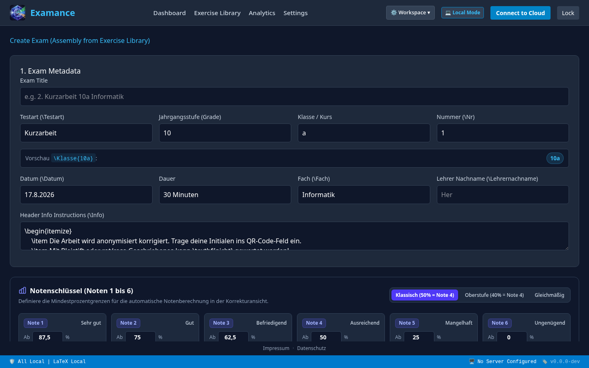
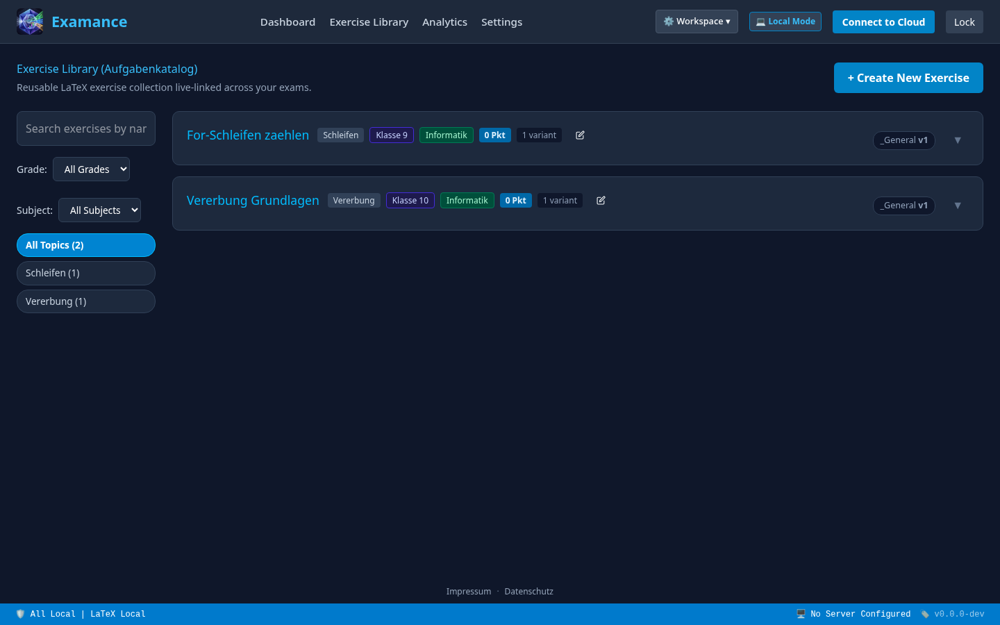
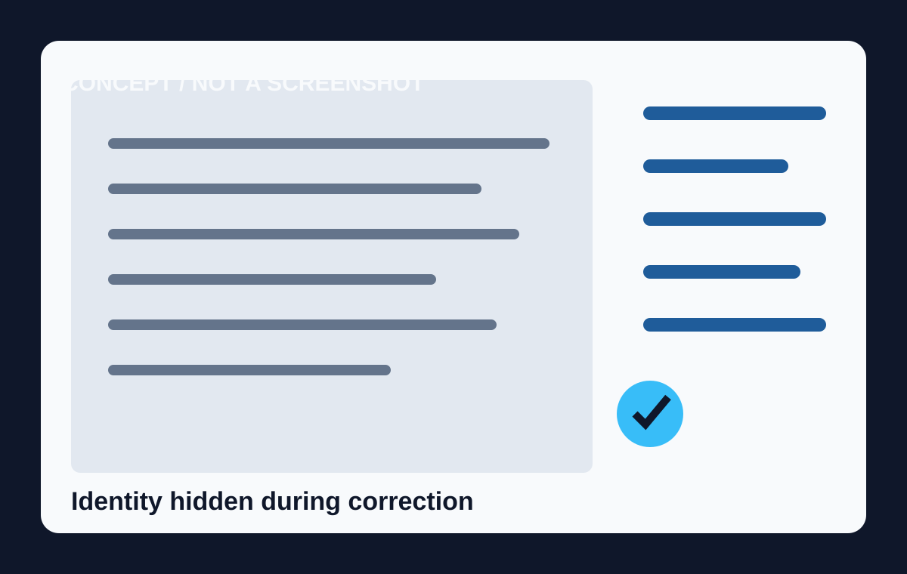
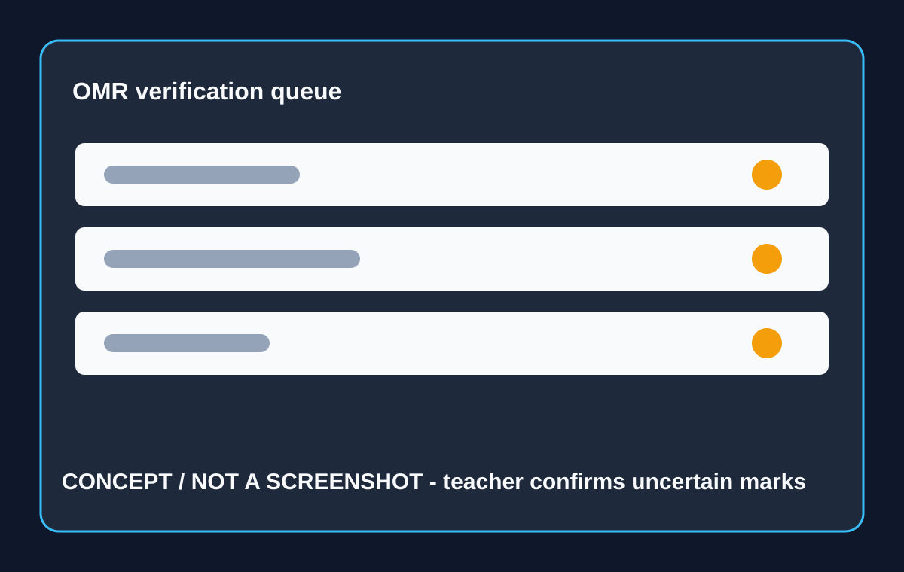
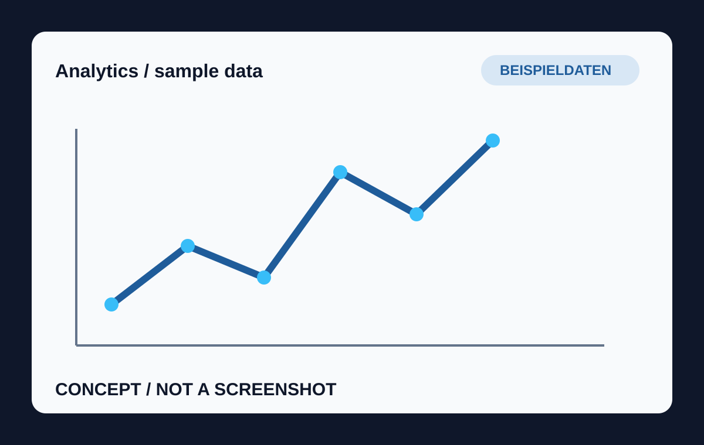

Examance / Für Lehrkräfte

# Mehr Zeit für gute Rückmeldung.

Der vertraute Papier-Test bleibt. Nur der mühsame Teil danach wird klarer, fairer und besser auswertbar.

VISUELLES KONZEPT / AKTUELLER UI-CAPTURE FOLGT

---

01 / Der bekannte Nachmittag

# Korrigieren ist wichtig. Alles drumherum nicht.

Namen, Punkte, Tabellen, Nachfragen. Die Rückmeldung an die Klasse wartet, während der Papierstapel wächst.

<b>Wiederverwenden</b>Aufgaben und Varianten bleiben auffindbar.

<b>Fairer korrigieren</b>Die Identität bleibt während des Markierens im Hintergrund.

<b>Schneller verstehen</b>Ergebnisse zeigen, was als Nächstes gelernt werden sollte.

---

02 / Der Ablauf

# Papier rein. Klarheit raus.

<b>01</b>Übung auswählen oder neu schreiben

<b>02</b>Heft drucken und austeilen

<b>03</b>Stapel scannen und korrigieren

<b>04</b>Ergebnisse für die nächste Stunde lesen

CONCEPT / WORKFLOW DIAGRAM

---

03 / Der Arbeitsplatz

<figure><figcaption>ALTE UI / LEGACY CAPTURE Exam-Aufbau: als Produktbeleg markiert, aktueller Capture folgt.</figcaption></figure>

<h2>Ein Test, nicht fünf Dateien.</h2>
Aufgaben, Punktelogik, Varianten und druckfertiger Satz gehören in einen Ablauf.

<strong>Für den Unterricht</strong> Auch bestehende Papier- und LaTeX-Routinen bleiben anschlussfähig.

---

04 / Wiederverwenden

# Gute Aufgaben müssen nicht verloren gehen.

Eine Bibliothek für Übungen, Themen, Jahrgänge und Varianten. Änderungen bleiben sichtbar, statt sich in Kopien zu verstecken.

<b>Einmal pflegen.</b>In mehreren Prüfungen sinnvoll einsetzen.

<figure><figcaption>ALTE UI / LEGACY CAPTURE Bibliothek: alte Oberfläche, nicht als aktueller Screenshot ausgeben.</figcaption></figure>

---

05 / Fairness

# Erst die Antwort. Dann der Name.

Beim Korrigieren zählt, was auf dem Blatt steht — nicht, wer darauf steht.

Die Korrektur ist pseudonym beziehungsweise identity-hidden. Die spätere Zuordnung für Noten und Verwaltung bleibt möglich.

<figure><figcaption>CONCEPT / NOT A SCREENSHOT Visualisierung des Korrekturschritts.</figcaption></figure>

---

06 / Automatische Unterstützung

# Automatik hilft. Die Lehrkraft entscheidet.

<figure><figcaption>CONCEPT / NOT A SCREENSHOT OMR-Verifikation mit sichtbaren Unsicherheiten.</figcaption></figure>

Bei MC- und SC-Aufgaben kann Examance Markierungen erkennen und zur Kontrolle vorlegen. Unklare Fälle bleiben sichtbar.

<strong>Wichtig</strong> Kein blindes Vertrauen in eine Zahl. Ein kurzer Prüfpunkt im Arbeitsfluss.

---

07 / Die nächste Stunde

# Aus dem Ergebnis wird eine Entscheidung.

<figure><figcaption>CONCEPT / NOT A SCREENSHOT Beispielhafte Auswertung; Zahlen sind Demo-Daten.</figcaption></figure>

<b>Wo hakt es?</b>Themen und Aufgaben sichtbar machen.

<b>Was war zu leicht?</b>Prüfungen über Zeit vergleichen.

<b>Was kommt jetzt?</b>Rückmeldung und Unterricht gezielter planen.

---

08 / Vertrauen

# Datenschutz verständlich im Arbeitsablauf.

<b>Account</b>Jede Nutzung läuft über ein Serverkonto.

<b>Schlüssel</b>Sensible Payloads werden clientseitig verschlüsselt.

<b>Hybrid</b>Ergebnisse bleiben in diesem Browser.

<b>Server</b>Ergebnisse können verschlüsselt auf dem Server liegen.

Die genaue Wahl hängt von Schulrichtlinie und Kontofähigkeiten ab. Pseudonym während der Korrektur bedeutet nicht anonym im gesamten Prozess.

---

09 / Nächster Schritt

# Ein echter Ablauf ist die beste Produktdemo.

Für einen sinnvollen Praxistest braucht es eine Prüfungssequenz, eine reale Korrekturroutine, freigegebene oder synthetische Beispieldaten und ehrliches Feedback zur Verständlichkeit.

<strong>Gesucht</strong> Lehrkräfte, die sagen, wo der Ablauf Zeit spart, wo er Fragen aufwirft und welche Rückmeldung im Unterricht wirklich ankommt.

