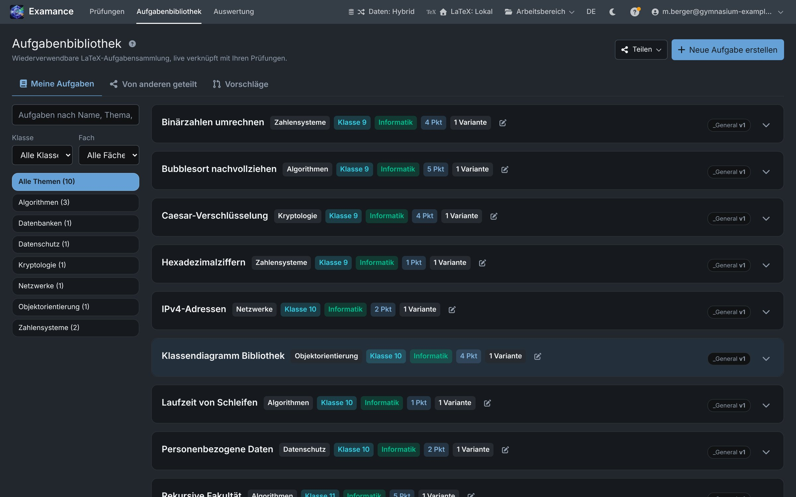
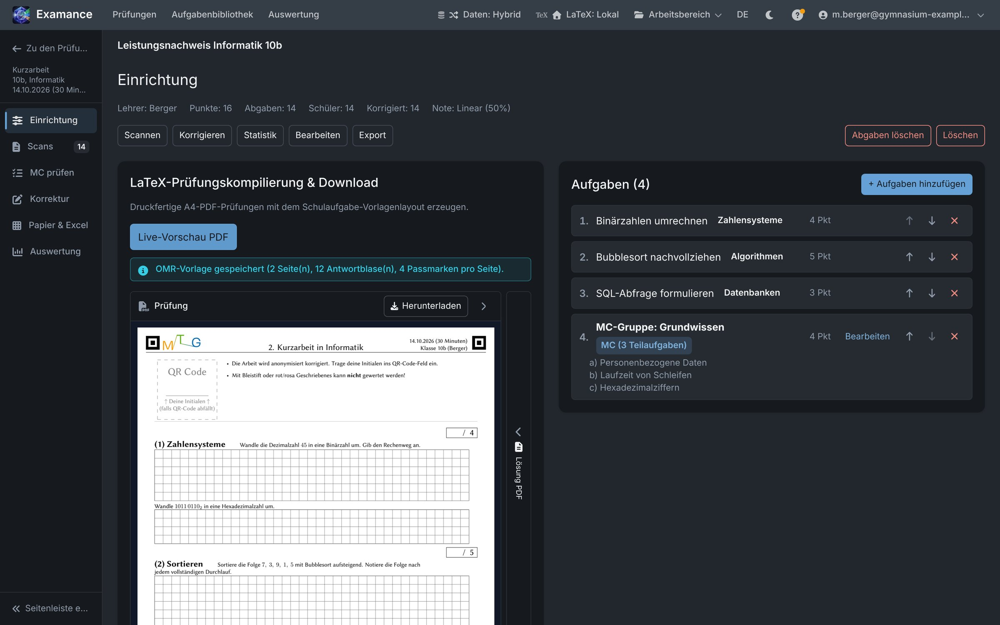
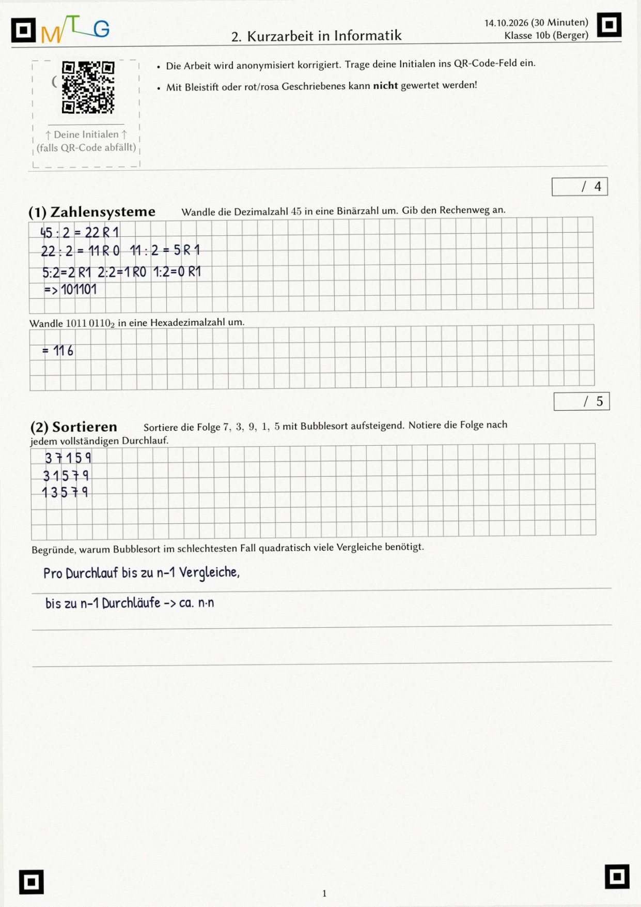
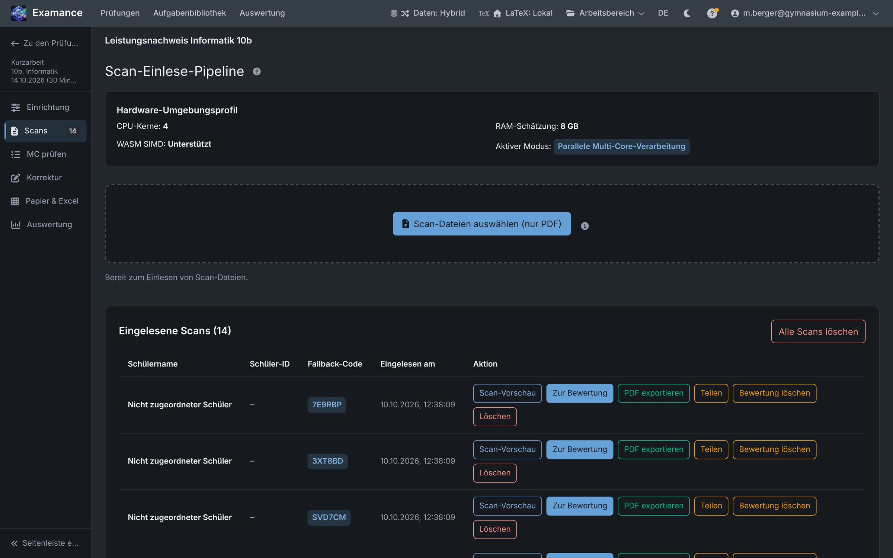
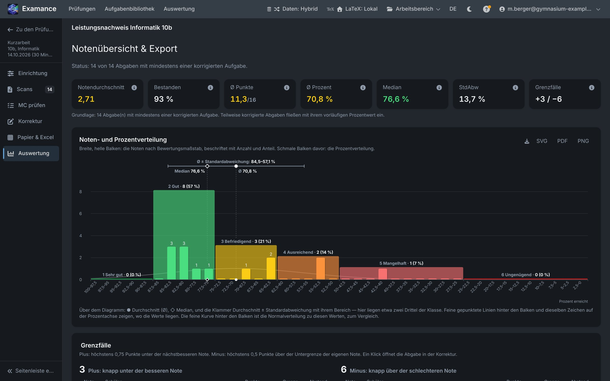

<!-- _class: title -->
<!-- _paginate: false -->

Für Lehrkräfte

# Die Klausur bleibt auf Papier. Der Aufwand drumherum wird kleiner.

Examance begleitet eine schriftliche Prüfung vom Aufgabenblatt bis zur Notenübersicht – im Browser, mit anonymer Korrektur und verschlüsselten Schülerdaten.

<figure class="shot"><figcaption>Korrekturansicht: Scan, Stempel, Punkte je Aufgabe</figcaption></figure>

---

Der Ablauf

# Fünf Schritte, ein Werkzeug

Was heute auf Word-Dateien, Kopierer, Rotstift und Tabellen verteilt ist, läuft in einer Reihenfolge.

<b>Aufgaben sammeln</b>Einmal anlegen, nach Thema, Klasse und Fach wiederfinden.

<b>Klausur setzen</b>Aufgaben auswählen, Notenschlüssel festlegen, druckfertiges PDF mit Lösung.

<b>Schreiben lassen</b>Ganz normal auf Papier. Jeder Bogen trägt einen QR-Code.

<b>Stapel scannen</b>Ein PDF vom Schulkopierer. Examance trennt und ordnet die Bögen zu.

<b>Korrigieren & auswerten</b>Ohne Namen korrigieren, danach Noten, Verteilung und Export.

Sie können jederzeit aussteigen: Punkte lassen sich auch von Hand in eine Tabelle eintragen („Papier & Excel“), und jede Klausur lässt sich als verschlüsseltes Archiv exportieren.

---

1 · Aufgabenbibliothek

<figure class="shot"><figcaption>Aufgabenbibliothek mit Filtern nach Thema, Klasse und Fach</figcaption></figure>

## Gute Aufgaben gehen nicht mehr verloren

<ul>
<li>Jede Aufgabe liegt einmal in der Bibliothek und ist in jeder späteren Klausur wieder verfügbar.</li>
<li><strong>Varianten</strong> (Gruppe A/B) teilen sich Punkte und Statistik.</li>
<li><strong>Versionen</strong>: Änderungen erzeugen eine neue Fassung, alte Klausuren bleiben unverändert.</li>
<li>Die Punktzahl wird aus dem Aufgabentext gezählt, nicht nachgetragen.</li>
<li>Optional mit der Fachschaft teilen, wenn die Schule das freischaltet.</li>
</ul>

---

2 · Klausur setzen

## Aus der Auswahl wird ein druckfertiges PDF

<ul>
<li>Aufgaben und Multiple-Choice-Gruppen zusammenstellen, Reihenfolge festlegen.</li>
<li>Notenschlüssel: linear, nach Oberstufenpunkten oder mit eigenen Grenzen.</li>
<li>Kopf mit Schullogo, Klasse, Datum und Punktetabelle – im vertrauten Schulaufgaben-Layout.</li>
<li>Lösungsblatt entsteht aus derselben Quelle.</li>
<li>Der Satz läuft standardmäßig <strong>im Browser</strong>; der Aufgabentext verlässt dabei das Gerät nicht.</li>
</ul>

<figure class="shot"><figcaption>Klausur mit vier Aufgaben, Vorschau des gesetzten PDFs</figcaption></figure>

---

3 · Scannen und zuordnen

# Ein Stapel, ein PDF, vierzehn Abgaben

<figure class="shot"><figcaption>Gescannter Bogen (synthetisch)</figcaption></figure>

<figure class="shot h340 bottom"><figcaption>Nach dem Einlesen: 14 Abgaben, nur mit Pseudonym-Code</figcaption></figure>

Der QR-Code verweist auf ein <strong>Pseudonym</strong>, nicht auf einen Namen. Unlesbare Codes landen in einer Prüfliste. Jede Seite wird sofort im Browser verschlüsselt.

---

4 · Korrigieren

<figure class="shot"><figcaption>„Anonymer Schüler #7 von 14“ – der Name ist während der Korrektur nicht sichtbar</figcaption></figure>

## Erst die Antwort. Dann der Name.

Sie sehen Handschrift, Aufgabe und Punkte – aber nicht, wer die Arbeit geschrieben hat. Die Zuordnung zur Person entsteht erst nach dem Korrekturgang.

<ul class="small">
<li>Stempel für ganze, halbe und Viertelpunkte, „Falsch“, „Fehlt“, Folgefehler.</li>
<li>Anmerkungen liegen als Ebene über dem Scan; das Original bleibt unverändert.</li>
<li>Die Note und der Abstand zur nächsten Notengrenze stehen daneben.</li>
<li>Funktioniert mit Maus, Stift und Tablet.</li>
</ul>

---

5 · Multiple Choice

# Kreuze werden gelesen. Sie entscheiden.

<figure class="shot"><figcaption>Prüfansicht einer erkannten MC-Antwort mit Scan-Ausschnitt</figcaption></figure>

<h3>Automatisch erkannt</h3>
Angekreuzte Kästchen werden beim Einlesen ausgewertet und mit dem Lösungsschlüssel verrechnet.

<h3>Unsicheres wird vorgelegt</h3>
Blasse, übermalte oder zurückgenommene Kreuze erscheinen markiert zur Bestätigung.

<h3>Stichproben</h3>
Auch sichere Erkennungen lassen sich zufällig nachprüfen.

---

6 · Auswertung

<figure class="shot"><figcaption>Notenübersicht einer Klausur (14 Abgaben, Demodaten)</figcaption></figure>

## Was die Klasse kann – und was nicht

<ul>
<li>Notendurchschnitt, Median, Verteilung und Bestehensquote auf einen Blick.</li>
<li><strong>Grenzfälle</strong>: wer knapp unter oder über einer Notengrenze liegt, mit direktem Sprung in die Korrektur.</li>
<li>Über mehrere Klausuren: welche Aufgaben regelmäßig schwach ausfallen, ob Varianten gleich schwer waren.</li>
<li>Export als Tabelle und PDF.</li>
</ul>

---

<!-- _class: center -->

Datenschutz in einfachen Worten

# Was der Server sieht – und was nicht

<h3>Liegt lesbar auf dem Server</h3>
<ul class="small">
<li>Aufgaben- und Klausurtexte (für Bibliothek und Satz)</li>
<li>Klausurdaten: Titel, Klasse, Fach, Datum, Ihr Nachname</li>
<li>Gesamtpunktzahl je Abgabe, ohne Namen</li>
<li>Ihre E-Mail-Adresse und Ihre Anmeldedaten</li>
</ul>

<h3>Nur mit Ihrem Schlüssel lesbar</h3>
<ul class="small">
<li>Namen und Nummern der Schülerinnen und Schüler</li>
<li>Scans, Anmerkungen und Punkte je Aufgabe</li>
<li>Der Schlüssel entsteht im Browser und verlässt ihn nicht – auch die Administration kann diese Daten nicht öffnen.</li>
</ul>

Im <strong>Hybrid-Modus</strong> verlassen Schülerdaten, Scans und Punkte den Browser gar nicht; im Server-Modus liegen sie dort nur verschlüsselt. Welcher Modus erlaubt ist, kann Ihre Schule festlegen. Angemeldet wird immer mit zwei Faktoren.

---

<!-- _class: center -->

Einstieg

# Was Sie brauchen

<h3>Ein Konto</h3>
Per Einladung der Administration oder selbst beantragt; Konten mit Schuladresse können automatisch freigeschaltet werden.

<h3>Einen zweiten Faktor</h3>
Authenticator-App oder Passkey (Fingerabdruck, Gesichtserkennung, Geräte-PIN) und einen Wiederherstellungscode auf Papier.

<h3>Browser und Kopierer</h3>
Ein aktueller Desktop-Browser oder ein Tablet; ein Kopierer, der einen Stapel in ein PDF scannt.

<h3>Examance ist in der Beta-Phase</h3>

Probieren Sie den Ablauf zuerst mit einer Probeklausur aus, bevor Sie eine echte Arbeit damit korrigieren. Im Hybrid-Modus liegen Ergebnisse nur in diesem Browser – sichern Sie sie über das verschlüsselte Archiv. Ein Handbuch ist in die App eingebaut (Fragezeichen oben rechts).

