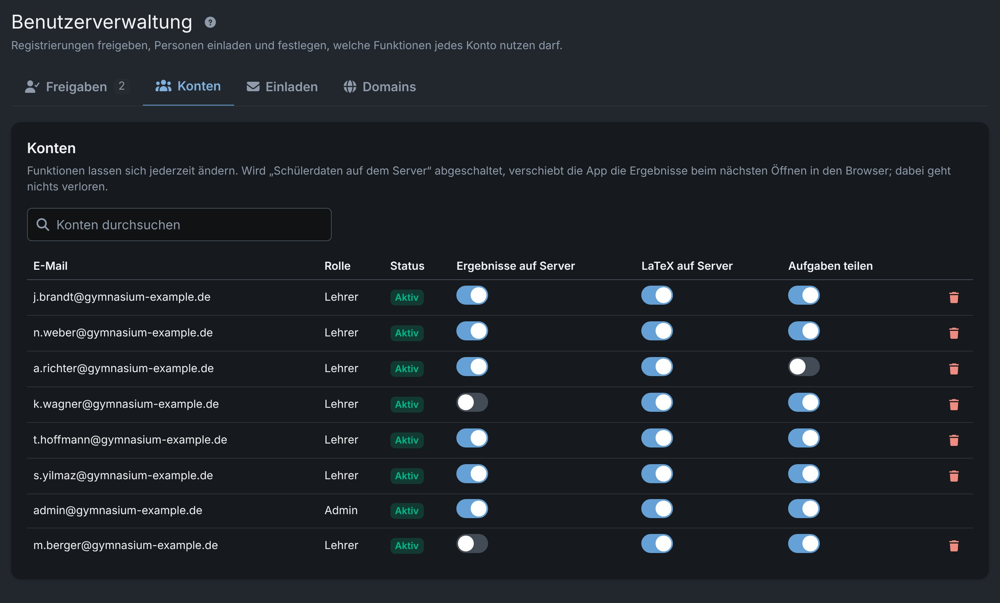

Für Schulleitung, Datenschutz und IT

# Prüfungsdaten, die der Server nicht lesen kann.

Examance unterstützt Lehrkräfte bei Papierklausuren: setzen, scannen, anonym korrigieren, auswerten. Schülerdaten werden im Browser verschlüsselt, bevor sie gespeichert werden.

## Was wo liegt

<table>
<tr><th>Daten</th><th>Für den Server lesbar?</th></tr>
<tr><td>Namen, Schülernummern, Scans, Anmerkungen, Einzelpunkte</td><td class="y">Nein – AES-256-GCM, Schlüssel nur im Browser</td></tr>
<tr><td>Gesamtpunktzahl je Abgabe</td><td class="n">Ja, pseudonym, ohne Namen</td></tr>
<tr><td>Klausurdaten (Titel, Klasse, Fach, Datum, Nachname der Lehrkraft), Aufgabentexte</td><td class="n">Ja</td></tr>
<tr><td>Konto: E-Mail, Rolle, Freischaltungen</td><td class="n">Ja (Passwort nur als Hash)</td></tr>
</table>

<figure class="shot"><figcaption>Benutzerverwaltung: Funktionen je Konto</figcaption></figure>

<h3>Die Administration kann</h3>
Konten freigeben und einladen, Schul-Domains hinterlegen, pro Konto Server-Ergebnisse, Server-LaTeX und Teilen erlauben.

<h3>Sie kann nicht</h3>
Klausuren, Ergebnisse oder Schülerdaten von Lehrkräften öffnen – auch nicht in der Datenbank oder nach einem Passwort-Reset.

## Sicherheit

<ul>
<li>Zwei Anmeldefaktoren sind Pflicht; Passkeys möglich</li>
<li>Zwei Speichermodi: Ergebnisse nur im Browser oder verschlüsselt auf dem Server</li>
<li>Auskunft und Löschung je Schülerin und Schüler (Art. 15/17)</li>
<li>Offener Quellcode (MIT), selbst betreibbar</li>
</ul>

## Vor dem Einsatz

<ul>
<li>Rechtsgrundlage und Aufbewahrungsfrist bestätigen</li>
<li>Betriebsmodell wählen, ggf. AV-Vertrag</li>
<li>DSFA und Verzeichnis abschließen (Vorlagen liegen bei)</li>
<li>Regel für private Endgeräte festlegen</li>
</ul>

<strong>Vorschlag:</strong> ein begrenzter Pilot in einer Fachschaft, zuerst mit erfundenen Daten, mit paralleler Datenschutzprüfung. Examance ist in der Beta-Phase.

