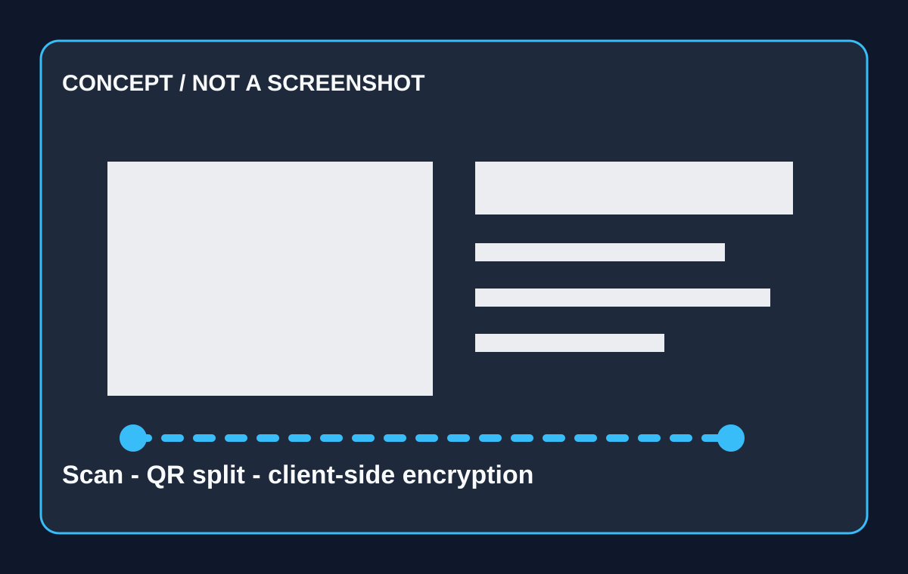

EXAMANCE / INFORMATIK

<h1>Prüfungen, die sich testen lassen.</h1>

LaTeX. Varianten. QR-Codes. Pseudonyme Korrektur. Ein durchgehender Workflow für echte Informatik-Klassen.

CONCEPT / NOT A SCREENSHOT

<h2>Der technische Ablauf</h2>

<b>01 / Authoring</b>Übungen, Punkte und Varianten in einer Bibliothek.

<b>02 / Druck</b>QR-codiertes Heft mit kontrollierten Versionen.

<b>03 / Scan</b>Stapel importieren, Seiten per QR zuordnen.

<b>04 / Korrektur</b>Antwort sehen, Identität im Arbeitsschritt ausblenden.

<b>05 / OMR</b>Markierungen erkennen und Unsicherheiten prüfen.

<b>06 / Analyse</b>Demo-Daten sichtbar als Grundlage für Feedback.

<h2>Für einen realistischen Pilot</h2><ul><li>Scanner und Auflösungen aus dem Schulalltag</li><li>echte Edge Cases bei QR und OMR</li><li>LaTeX-Vorlagen und Variantenlogik</li><li>Rückmeldung zur Korrekturerfahrung</li></ul>
Benötigt werden ein realer Ablauf und freigegebene oder synthetische Beispieldaten.

Examance · Produktname aktuell · alle Visualisierungen mit Status gekennzeichnet

